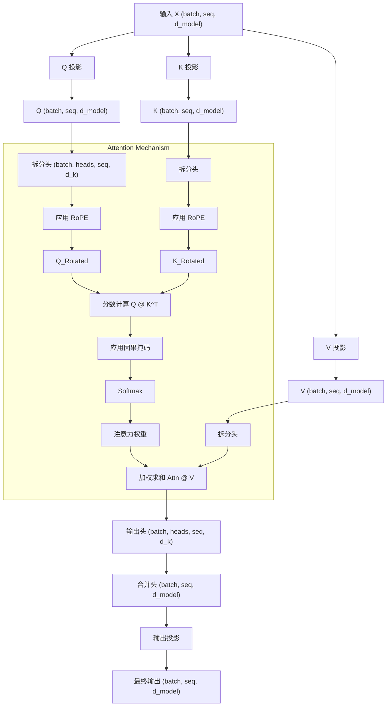
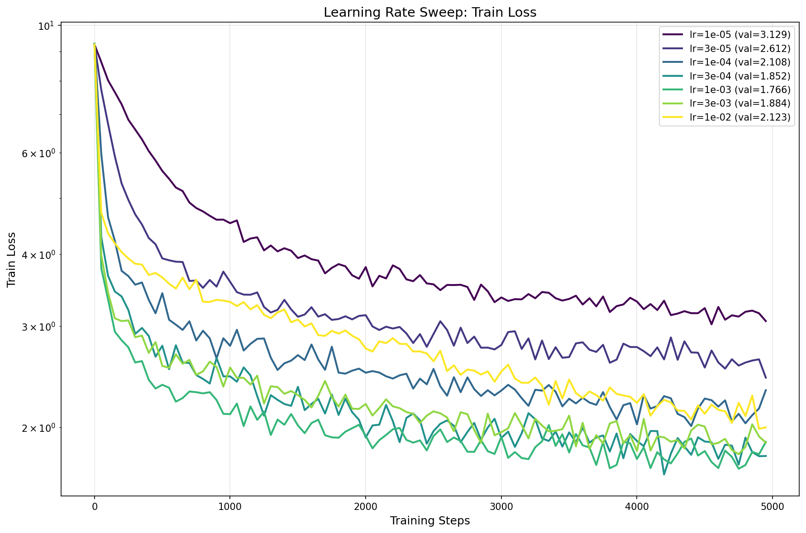
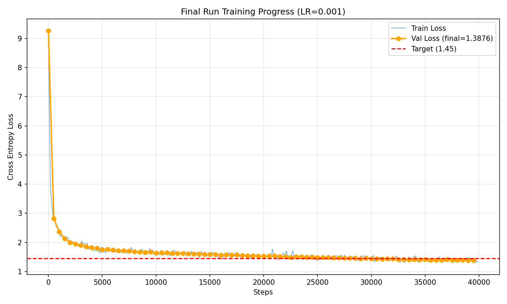

# 2 BPE 分词器

## 2.1 Unicode 标准

**Q1.a** 

chr(0) returns '\x00' (其实代表的字符是null）；

**Q1.b**

chr(0) 的字符表示与打印表示不一样，用 repr() 会看到 '\x00'，但是 print() 会看到一个空白；

**Q1.c**

虽然 chr(0) 存在于字符串中，但在打印输出时它是不可见且无宽度的，这会导致前后的文本看起来紧紧相邻，完全掩盖了该字符的存在。

## 2.2 Unicode 编码

**Q2.a**

UTF-8 避免了 UTF-16 和 UTF-32 中常见的冗余零字节填充（尤其是对于 ASCII 字符），这防止了 BPE 浪费词表空间去学习无意义的编码占位模式。此外，UTF-8 作为互联网标准，在处理绝大多数现代语料时更具空间效率，且由于其字节流特性而无需处理大小端序（Endianness）带来的复杂性。

**Q2.b**

示例输入：b'\xe4\xbd\xa0'（汉字“你”的 UTF-8 编码）。由于 UTF-8 是一种变长编码，非 ASCII 字符（如中文或 Emoji）是由 2 到 4 个字节组成的序列，该函数尝试逐个字节地独立解码会破坏编码序列的完整性，导致无法识别多字节字符并抛出 UnicodeDecodeError。

**Q3.c**

示例：b'\xff\xff'。在 UTF-8 编码规范中，字节 0xFF 被明确禁止使用，因为它不符合任何合法的单字节或多字节起始位规则，因此无法与任何字符对应。

## 2.3 字词分词

## 2.4 BPE 分词器训练

词表初始化、预分词、计算 BPE 合并。需要注意特殊Token。

## 2.5 尝试 BPE 分词器训练

我们在 TinyStories 数据集上训练一个字节级 BPE 分词器。代码位于GitHub。

首先实现BPE，**从大量文本中学习出一个词表（Vocabulary）和一组合并规则（Merges）**。我们使用 GPT-2 的预分词规则。此外需要在 Tiny Stories 和 OpenWeb Text 上训练。耗时会比较长。

**Q4** 

BPE分词器训练

**Q5** 

在 TinyStories 上进行 BPE 训练，耗时 48 分钟（估计是因为后台有别的东西在同时跑），峰值内存 38.8 GB。最长的 token 是 **accomplishment**（15 字节），这是一个常见的英语单词，常出现在儿童故事中表达成就感，完全合理。

**Q6** 

在 OpenWebText 上进行 BPE 训练，用一开始的脚本会爆内存，但是我是 coding 苦手，只好让 Claude 帮我优化了（ 优化后的耗时 5.1 小时，内存占用 11.85 GB。最长 token 是 **64 字节的重复 UTF-8 序列 (\xc3\x83\xc3\x82...)**，这实际上是编码错误导致的乱码字符被频繁合并。这在真实网页数据中很常见，说明 OpenWebText 包含一些编码损坏的内容。

## 2.6 BPE 分词器：编码与解码

现在，我们将实现一个 BPE 分词器，它加载提供的词表和合并列表，并使用它们将文本编码为 Token ID 或从 Token ID 解码。

### 2.6.1 编码文本

BPE 编码文本与训练 BPE 词表的过程类似：预分词 - 应用合并。

### 2.6.2 解码文本

**Q7** 

实现 tokenizer 。

**Q8.a** 

TinyStories tokenizer (10k vocab) 对其验证集的压缩率为 4.03 bytes/token，而 OpenWebText tokenizer (32k vocab) 对 OWT 验证集的压缩率为 4.70 bytes/token。

**Q8.b** 

如果使用 TinyStories tokenizer 对 OpenWebText 数据进行分词，压缩率下降为 3.29 bytes/token。这是因为 TinyStories 的词表是针对简单儿童故事优化的，缺乏 OWT 中复杂多样的词汇，导致更多单词被拆解为更碎的字符级 token。

**Q8.c** 

分词器的吞吐量约为 1.66 MB/s。按照这个速度，处理 825GB 的 Pile 数据集大约需要 148 小时（约 6.2 天）。

**Q8.d** 

uint16 是合适的选择，因为我们的最大词表大小为 32,000，完全在 uint16（0-65535）的表示范围内。相比默认的 int64（8 字节），使用 uint16（2 字节）可以节省 75% 的内存和存储空间，这对于处理数十 GB 的大规模数据集至关重要。

# 3 Transformer 

在本部分作业中，将从头开始构建这个 Transformer 语言模型。我们将从模型的高层描述开始，然后逐步详细介绍各个组件。

## 3.1 Transformer LM

Transformer 语言模型使用输入嵌入将 Token ID 转换为稠密向量，将嵌入的 Token 通过  num_layers  个 Transformer 块，然后应用一个学习到的线性投影（“输出嵌入”或“LM Head”）来产生预测的下一个令牌 Logits。

在操作中，我们将使用 Einops 来使我们对于张量的操作更加易读。

**我们在本作业的数学符号中将使用列向量**。

## 3.4 基础构建块：线性层 

**Q9** 

实现线性层

**Q10** 

实现 Embedding 层

## 3.5 PreNorm Transformer块

研究发现将归一化移到子层输入端可以显著提高 Transformer 训练过程的稳定性。Pre‑norm 的一个直觉是，从输入嵌入到 Transformer 的最终输出存在一条没有任何归一化的纯净 “残差流”，据称这可以改善梯度流。

**Q11** 

实现 RMSNorm 

**Q12** 

实现 SwiGLU 逐位置前馈网络

**Q13** 

实现相对位置嵌入 RoPE

对于位置 $i$ 处的向量，旋转角度为： $$\theta_{i,k} = \frac{i}{\Theta^{(2k-2)/d}} \quad \text{for } k \in {1, ..., d/2}$$

每对元素 $(x_{2k-1}, x_{2k})$ 通过 2×2 旋转矩阵变换： 
$$
\begin{bmatrix} x'_{2k-1} \\ x'_{2k} \end{bmatrix} =
\begin{bmatrix}
\cos(\theta_{i,k})  & -\sin(\theta_{i,k})\\
\sin(\theta_{i,k})  & \cos(\theta_{i,k})
\end{bmatrix}
\begin{bmatrix} x_{2k-1} \\ x_{2k} \end{bmatrix}
$$
这里有个坑debug了好久，`torch.einsum` 和 `einops.einsum` 支持的风格不一样，有一处 Antigravity 自动改成了 `torch.einsum` 没注意到一直 debug 不过。。。

**Q14** 

实现 Softmax 函数

**Q15**

实现 SDPA

**Q16** 

实现因果多头自注意力
$$
\text{MultiHeadSelfAttention}(x) = W_O \cdot \text{MultiHead}(W_Q x, W_K x, W_V x)
$$
其中 `MultiHead` 是并行运行 h 个注意力头，然后拼接。
    

## 3.6 全 Transformer 语言模型

**Q17**

实现 Transformer 块

**Q18**

实现 Transformer LM

**Q19.a**

各组件参数

| 组件                    | 形状                   | 参数量                          |
| :---------------------- | :--------------------- | :------------------------------ |
| **Token Embedding**     | (vocab_size, d_model)  | 50,257 × 1,600 = **80,411,200** |
| **Per Layer:**          |                        |                                 |
| - Q/K/V Projection (×3) | 3 × (d_model, d_model) | 3 × 1,600² = 7,680,000          |
| - Output Projection     | (d_model, d_model)     | 1,600² = 2,560,000              |
| - RMSNorm (×2)          | 2 × d_model            | 2 × 1,600 = 3,200               |
| - FFN w1, w3            | 2 × (d_ff, d_model)    | 2 × 6,400 × 1,600 = 20,480,000  |
| - FFN w2                | (d_model, d_ff)        | 1,600 × 6,400 = 10,240,000      |
| **Per Layer Total**     |                        | **40,963,200**                  |
| **All Layers**          | × 48                   | **1,966,233,600**               |
| **Final RMSNorm**       | d_model                | 1,600                           |
| **LM Head**             | (vocab_size, d_model)  | 50,257 × 1,600 = **80,411,200** |

总参数 = 80,411,200 + 1,966,233,600 + 1,600 + 80,411,200 ≈ 2.13B

内存（FP32）= 2.13B × 4 bytes = 8.52 GB

**Q19.b**

已知矩阵乘法 $A \in \mathbb{R}^{m \times n}$ 和 $B \in \mathbb{R}^{n \times p}$ 需要 2mnp FLOPs，设 batch=1, seq_len=1024, d=1600, h=25, d_k=64, d_ff=6400，有：

| 矩阵乘法                   | 形状                             | FLOPs                                    |
| :------------------------- | :------------------------------- | :--------------------------------------- |
| **Embedding Lookup**       | (无矩阵乘法)                     | 0                                        |
| **Per Layer:**             |                                  |                                          |
| Q Projection               | (seq, d) × (d, d)                | 2 × 1024 × 1600 × 1600                   |
| K Projection               | same                             | 2 × 1024 × 1600²                         |
| V Projection               | same                             | 2 × 1024 × 1600²                         |
| Attention Scores (Q @ K^T) | (seq, d_k) × (d_k, seq) per head | 2 × h × seq² × d_k = 2 × 25 × 1024² × 64 |
| Attention × V              | (seq, seq) × (seq, d_k) per head | 2 × 25 × 1024² × 64                      |
| Output Projection          | (seq, d) × (d, d)                | 2 × 1024 × 1600²                         |
| FFN w1                     | (seq, d) × (d, d_ff)             | 2 × 1024 × 1600 × 6400                   |
| FFN w3                     | same                             | 2 × 1024 × 1600 × 6400                   |
| FFN w2                     | (seq, d_ff) × (d_ff, d)          | 2 × 1024 × 6400 × 1600                   |
| **LM Head**                | (seq, d) × (d, vocab)            | 2 × 1024 × 1600 × 50257                  |

**Q19.c**

FFN 部分消耗最多的 FLOPs，这是因为 FFN 部分涉及到三个大矩阵的计算，而且维度 d_ff = 4 * d_model。

**Q19.d**

| Model        | Total       | Attention | Projections | FFN       | LM Head   |
| :----------- | :---------- | :-------- | :---------- | :-------- | :-------- |
| GPT-2 Small  | 350 GFLOPs  | 11.1%     | 16.6%       | 49.8%     | **22.6%** |
| GPT-2 Medium | 1.03 TFLOPs | 10.0%     | 20.0%       | 59.9%     | 10.2%     |
| GPT-2 Large  | 2.26 TFLOPs | 8.6%      | 21.4%       | 64.2%     | 5.8%      |
| GPT-2 XL     | 4.51 TFLOPs | 7.1%      | 22.3%       | **66.9%** | 3.6%      |

**Q19.e**

| Metric      | context=1024 | context=16384 | Change    |
| :---------- | :----------- | :------------ | :-------- |
| Total FLOPs | 4.51 TFLOPs  | 149.52 TFLOPs | **33.1×** |
| Attention % | 7.1%         | **55.2%**     | ↑↑↑       |
| FFN %       | 66.9%        | 32.3%         | ↓↓        |
| LM Head %   | 3.6%         | 1.8%          | ↓         |

随着上下文长度的变成 16 倍，总消耗 FLOPs 变成了原来的 33 倍。主要是注意力机制消耗的 FLOPs 以平方量级变多。

# 4 训练 Transformer LM

我们现在已经完成了：通过 Tokenizer 完成预处理数据、实现 Transformer 模型。接下来，我们要编写支持训练的代码，这包括：Loss、Optimizer、Loops。

## 4.1 交叉熵损失

**Q20**

实现交叉熵损失。

根据教程公式 (16) 和 (17)，交叉熵损失定义为负对数似然:
$$
\ell = -\log p(y | \text{context})
$$
其中概率 $p$ 由 Softmax 函数给出:
$$
p(y | \text{context}) = \text{softmax}(o)_y = \frac{e^{o_y}}{\sum_{k=1}^{Vocab\_size} e^{o_k}}
$$
代入后得到：
$$
\ell = -\log \left( \frac{e^{o_y}}{\sum_{k=1}^{Vocab\_size} e^{o_k}} \right)
$$
为了减少计算量并避免精度损失，我们利用对数性质 $\log(\frac{a}{b}) = \log a - \log b$ 展开：
$$
\begin{aligned}

\ell &= - \left[ \log(e^{o_y}) - \log \left( \sum_{k=1}^V e^{o_k} \right) \right] \\

   &= - \left[ o_y - \log \left( \sum_{k=1}^V e^{o_k} \right) \right] \\

   &= -o_y + \log \left( \sum_{k=1}^V e^{o_k} \right)

\end{aligned}
$$
但是如果 $o_k$ 很大 (例如 100)，$e^{100}$ 会导致浮点数上溢，因此进一步优化：利用恒等式 $\log \sum e^{o_k} = m + \log \sum e^{o_k - m}$，其中 $m$ 是任意常数。通常取最大值 $m = \max(o)$。
$$
\begin{aligned}
\log \left( \sum_{k=1}^V e^{o_k} \right) &= \log \left( \sum_{k=1}^V e^{o_k - m + m} \right) \\
&= \log \left( \sum_{k=1}^V e^{m} \cdot e^{o_k - m} \right) \\
&= \log \left( e^m \cdot \sum_{k=1}^V e^{o_k - m} \right) \\
&= \log(e^m) + \log \left( \sum_{k=1}^V e^{o_k - m} \right) \\
&= m + \log \left( \sum_{k=1}^V e^{o_k - m} \right)
\end{aligned}
$$
这样所有指数项 $e^{o_k - m}$ 的指数部分都不超过 0，避免了上溢。

因此，我们需要实现的是：
$$
\ell = \underbrace{-o_y}_{\text{Target Logit}} + \underbrace{m + \log \left( \sum_{k=1}^V e^{o_k - m} \right)}_{\text{Stable LogSumExp}}
$$
对应代码逻辑：

1.  找出最大值 $m = \max(o)$
2.  计算稳定 LogSumExp: $lse = m + log(sum(exp(o - m)))$
3.  计算损失: $loss = -o[y] + lse$

## 4.2 SGD 优化器

**Q21**

- **1e1 (10.0)**：损失函数收敛，但速度较慢（从 24.17 降至 3.25）。
- **1e2 (100.0)**：损失函数迅速收敛，在第 5 次迭代时降至 0.00，表现最佳。这是因为你的 SGD 实现包含了 $1/\sqrt{t}$ 的衰减，虽然初始步长可能导致震荡（$w \to -w$），但由于衰减很快进入收敛区。
- **1e3 (1000.0)**：损失函数发散（Diverge），数值迅速爆炸至 $10^{18}$ 数量级，说明学习率过大导致步长远超最优值，不断过冲并远离极小值点。

## 4.3 AdamW 优化器

**Q22**

实现 AdamW 优化器。 

初始化：$m_0 = 0$, $v_0 = 0$（与参数形状相同）

对于每次迭代 $t = 1, 2, ..., T$:

1. $g \leftarrow \nabla_\theta \mathcal{L}(\theta; B_t)$ — 计算梯度
2. $m \leftarrow \beta_1 m + (1 - \beta_1) g$ — 一阶矩估计（动量）
3. $v \leftarrow \beta_2 v + (1 - \beta_2) g^2$ — 二阶矩估计（平方梯度的 EMA）
4. $\alpha_t \leftarrow \alpha \cdot \frac{\sqrt{1 - \beta_2^t}}{1 - \beta_1^t}$ — 偏置校正后的学习率
5. $\theta \leftarrow \theta - \alpha_t \cdot \frac{m}{\sqrt{v} + \epsilon}$ — 参数更新
6. $\theta \leftarrow \theta - \alpha \lambda \theta$ — 权重衰减（decoupled）

**Q23.a**

使用 **float32**，意味着每个值 4 字节。定义符号如下：

- $V$ = vocab_size
- $S$ = context_length
- $L$ = num_layers
- $d$ = d_model
- $H$ = num_heads
- $d_{ff}$ = d_ff (通常 = $4d$)
- $B$ = batch_size

首先计算参数量 $P$。

| 组件                         | 参数量                   |
| :--------------------------- | :----------------------- |
| Token Embedding              | $V \cdot d$              |
| Per Layer: Q/K/V Projection  | $3 \cdot d \cdot d$      |
| Per Layer: Output Projection | $d \cdot d$              |
| Per Layer: RMSNorm (×2)      | $2 \cdot d$              |
| Per Layer: FFN w1, w3        | $2 \cdot d \cdot d_{ff}$ |
| Per Layer: FFN w2            | $d_{ff} \cdot d$         |
| Final RMSNorm                | $d$                      |
| LM Head                      | $d \cdot V$              |

$$\boxed{P = 2Vd + L(4d^2 + 3d \cdot d_{ff} + 2d) + d}$$ ->$4P$ 字节

**梯度内存**

每个参数有一个梯度，形状相同。总参数量为 P ->$4P$ 字节

**优化器状态内存**

AdamW 存储 $m$ 和 $v$，各与参数等大，总参数量为 2P -> $8P$ 字节

**激活值内存 $A$**

| 组件                       | 形状             | 元素数     |
| :------------------------- | :--------------- | :--------- |
| **每层 Transformer Block** |                  |            |
| RMSNorm 输入 (×2)          | $(B, S, d)$ ×2   | $2BSd$     |
| Q, K, V 投影输出           | $(B, S, d)$ ×3   | $3BSd$     |
| Q @ K^T scores             | $(B, H, S, S)$   | $BHS^2$    |
| Softmax 输出               | $(B, H, S, S)$   | $BHS^2$    |
| Attention @ V              | $(B, H, S, d/H)$ | $BSd$      |
| Output Projection          | $(B, S, d)$      | $BSd$      |
| FFN w1 输出                | $(B, S, d_{ff})$ | $BSd_{ff}$ |
| SiLU(w1)                   | $(B, S, d_{ff})$ | $BSd_{ff}$ |
| FFN w3 输出                | $(B, S, d_{ff})$ | $BSd_{ff}$ |
| FFN w2 输出                | $(B, S, d)$      | $BSd$      |
| **全局**                   |                  |            |
| Final RMSNorm              | $(B, S, d)$      | $BSd$      |
| Output Embedding (logits)  | $(B, S, V)$      | $BSV$      |
| Cross-Entropy (targets等)  | $(B, S)$         | $BS$       |

每层激活： $$A_{layer} = 8BSd + 2BHS^2 + 3BSd_{ff}$$ -> 总激活： $$\boxed{A = L \cdot (8BSd + 2BHS^2 + 3BSd_{ff}) + BSd + BSV + BS}$$ -> 激活内存：$4A$ 字节

**总峰值内存**

$$\boxed{\text{Memory}_{peak} = 4P + 4P + 8P + 4A = 16P + 4A}$$

展开：

$$\text{Memory}_{peak} = 16 \cdot \left[ 2Vd + L(4d^2 + 3d \cdot d*{ff} + 2d) + d \right]$$ $$+ 4 \cdot \left[ L(8BSd + 2BHS^2 + 3BSd_{ff}) + BSd + BSV + BS \right]$$

化简有

$$\boxed{\text{Memory} = 16P + 4BS \cdot \left[ L(8d + 2HS + 3d_{ff}) + d + V + 1 \right]}$$

**Q23.b**

对 GPT-2 XL，已知：

- $P \approx 2.13 \times 10^9$
- $V = 50257$, $S = 1024$, $L = 48$, $d = 1600$, $H = 25$, $d_{ff} = 6400$

- 激活开销（与 batch 成正比）：
- 每层激活元素： $$6 \cdot S \cdot d + 2 \cdot H \cdot S^2 + 3 \cdot S \cdot d_{ff} = 6 \cdot 1024 \cdot 1600 + 2 \cdot 25 \cdot 1024^2 + 3 \cdot 1024 \cdot 6400$$ $$= 9.83M + 52.4M + 19.7M \approx 82M$$
- 总激活（48层）：$48 \times 82M + 1024 \times 1600 + 1024 \times 50257 \approx 4B$ per batch element
- 激活内存 = $4 \times 4B \times B$ bytes = $16B$ GB (where $B$ is batch size)
- 求解： $$31.7 + 16B \leq 80$$ $$B \leq 3$$，也即 $$\boxed{\text{max batch\_size} \approx 3}$$

**Q23.c**

对于 AdamW 一步的 FLOPs，已知 AdamW 对每个参数执行：

1. $m = \beta_1 m + (1-\beta_1)g$ → **3 FLOPs** (mul, sub, mul-add)
2. $v = \beta_2 v + (1-\beta_2)g^2$ → **4 FLOPs** (square, mul, sub, mul-add)
3. $\alpha_t$ 计算 → 常数（忽略）
4. $\theta = \theta - \alpha_t \cdot m / (\sqrt{v} + \epsilon)$ → **4 FLOPs** (sqrt, add, div, mul-sub)
5. $\theta = \theta - \alpha\lambda\theta$ → **2 FLOPs** (mul, sub)

总计：$\approx 13$ FLOPs per parameter

$$\boxed{\text{FLOPs}_{AdamW} \approx 13P}$$

感觉似乎不对，不过问 AI 说是：“<u>精确数字不那么重要，重要的是**数量级**：$$\text{FLOPs}_{AdamW} = O(P)$$。</u>

<u>即 AdamW 的 FLOPs 与参数量成正比，远小于前向/后向传播（$O(P \cdot S)$），所以在总训练成本中通常**可以忽略**。</u>”

**Q23.d**

已知A100 峰值: 19.5 TFLOP/s (float32)、50% MFU、400K steps、batch_size=1024、后向传播 FLOPs = 2× 前向传播。

- 前向 FLOPs（之前计算）：$\approx 4.51$ TFLOPs per sequence
- 每步 FLOPs： $$\text{FLOPs/step} = \text{batch\_size} \times (\text{forward} + \text{backward})$$ $$= 1024 \times (4.51 + 2 \times 4.51) \text{ TFLOPs} = 1024 \times 13.53 \text{ TFLOPs} \approx 13,855 \text{ TFLOPs}$$
- 总 FLOPs： $$400000 \times 13855 \times 10^{12} = 5.54 \times 10^{21} \text{ FLOPs}$$
- 实际吞吐量： $$19.5 \times 0.5 = 9.75 \text{ TFLOP/s}$$
- 训练时间： $$\frac{5.54 \times 10^{21}}{9.75 \times 10^{12}} = 5.68 \times 10^8 \text{ seconds} \approx 6580 \text{ days}$$ $$\boxed{\approx 18 年}$$

## 4.4 学习率调度

**Q24**

实现带预热的余弦学习率调度

## 4.5 梯度裁切

**Q25**

实现梯度裁切

# 5 训练循环

## 5.1 数据加载器

**Q26**

实现数据加载

## 5.2 检查点

**Q27**

实现模型检查点

## 5.3 训练循环

**Q28**

整合

# 6 文本生成

**Q29**

实现解码功能

# 7 实验

是时候将一切整合在一起，并在数据集上训练一个小型语言模型了。

## 7.1 运行与交付

**Q30**

实现实验日志记录

## 7.2 TinyStories

**Q31.a**

采用了**对数均匀网格搜索**（log-uniform grid search）策略来确定最优学习率。

选取的候选范围跨越了 $10^{-5}$ 到 $10^{-2}$（具体为 $1\times10^{-5}, 3\times10^{-5}, \dots, 1\times10^{-2}$），以覆盖多个数量级。

目标是找到最高的稳定学习率（即**稳定边缘**），以便在不导致发散的前提下最大化收敛速度。

采用之前实现的调度器等，实现了 Loss < 1.45。

**Q31.b**

| Learning Rate | Train Loss |  Val Loss  |   评价   |
| :-----------: | :--------: | :--------: | :------: |
|     1e-05     |   3.0606   |   3.1288   | 收敛太慢 |
|     1e-04     |   2.3212   |   2.1084   |   正常   |
|     3e-04     |   1.7841   |   1.8516   |   不错   |
|   **1e-03**   | **1.8869** | **1.7658** | **最佳** |
|     3e-03     |   1.8823   |   1.8837   | 开始退化 |
|     1e-02     |   2.0004   |   2.1229   | 明显变差 |

注意 1e-02，虽然没有完全发散，但 Loss 明显上升，说明接近了稳定边缘。

**Q32**

生成文本

> Once upon a time there was a little girl named Lily. She loved to play with her friends and do lots of things. One day she heard a loud noise coming from the sky and she got very scared. She started to run away but her friends were watching her. They shouted, "Lily, don't worry! It's just the wind and the birds singing!"
>
> Lily felt very brave and asked her friends if they could help. They all said yes and all began to look up at the sky. Lily was so excited that she wanted to help.
>
> Soon the wind started to blow and suddenly, it started to rain and the birds flew away. Lily was very scared, but then she saw something beautiful. It was a rainbow! She ran to the rainbow and picked it up. It was so beautiful!
>
> Lily was so happy that she had helped someone in need. She thanked her friends for helping her and they all went home. The little girl and her friends had the best day ever.

影响输出质量的因素：

- **Temperature (0.8)**: 提供了足够的随机性，让故事不至于死板（不仅仅是选择概率最大的词），同时又没有高到让逻辑崩坏。
- **Nucleus Sampling (Top-p 0.95)**: 有效截断了长尾低概率词，防止生成生僻或不通顺的词，保证了文本的连贯性。

## 7.3 消融实验与架构修改

**Q33-35**

| 实验                                        | Val Loss | vs Baseline |
| :------------------------------------------ | :------: | :---------: |
| **Baseline** (Pre-Norm+RMSNorm+RoPE+SwiGLU) | **1.39** |      -      |
| No RMSNorm (LR=1e-3)                        |   1.55   |    +12%     |
| No RMSNorm (LR=1e-4)                        |   1.86   |    +34%     |
| Post-Norm                                   |   1.50   |     +8%     |
| NoPE (No Position)                          |   1.57   |    +13%     |
| SiLU FFN (param-matched)                    |   1.52   |     +9%     |

1. **RMSNorm**: 非常关键。移除后训练不稳定，降低 LR 反而更差。
2. **Pre-Norm > Post-Norm**: 8% 优势，梯度流更顺畅。
3. **RoPE 必不可少**: 无位置信息损失 13%。
4. **SwiGLU > SiLU**: 即使参数对齐，SwiGLU 的门控机制仍提供 9% 优势。

## 7.4 在 OpenWebText 上运行

**Q36**

在 OWT 上训练

| Dataset         | Vocab Size | Final Val Loss | Perplexity |
| :-------------- | :--------: | :------------: | :--------: |
| **TinyStories** |    10k     |    **1.39**    |    ~4.0    |
| **OpenWebText** |    32k     |    **3.93**    |   ~51.0    |

OWT 的 Loss 显著更高 (+2.54)。这主要是因为更大的词表（随机基准 Loss 高 +1.15）以及数据本身的极高复杂度和多样性。

OWT 模型生成的文本局部通顺（语法正确），但缺乏长期逻辑（因为模型容量小且训练时间短）。

