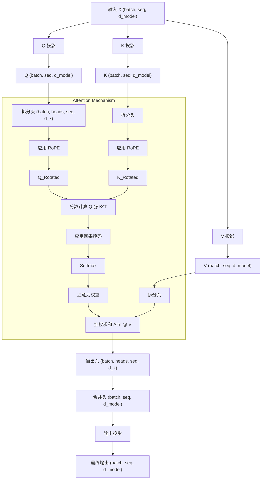

# 2 BPE 分词器

## 2.1 Unicode 标准

**Q1.a** 

chr(0) returns '\x00' (其实代表的字符是null）；

**Q1.b**

chr(0) 的字符表示与打印表示不一样，用 repr() 会看到 '\x00'，但是 print() 会看到一个空白；

**Q1.c**

虽然 chr(0) 存在于字符串中，但在打印输出时它是不可见且无宽度的，这会导致前后的文本看起来紧紧相邻，完全掩盖了该字符的存在。

## 2.2 Unicode 编码

**Q2.a**

UTF-8 避免了 UTF-16 和 UTF-32 中常见的冗余零字节填充（尤其是对于 ASCII 字符），这防止了 BPE 浪费词表空间去学习无意义的编码占位模式。此外，UTF-8 作为互联网标准，在处理绝大多数现代语料时更具空间效率，且由于其字节流特性而无需处理大小端序（Endianness）带来的复杂性。

**Q2.b**

示例输入：b'\xe4\xbd\xa0'（汉字“你”的 UTF-8 编码）。由于 UTF-8 是一种变长编码，非 ASCII 字符（如中文或 Emoji）是由 2 到 4 个字节组成的序列，该函数尝试逐个字节地独立解码会破坏编码序列的完整性，导致无法识别多字节字符并抛出 UnicodeDecodeError。

**Q3.c**

示例：b'\xff\xff'。在 UTF-8 编码规范中，字节 0xFF 被明确禁止使用，因为它不符合任何合法的单字节或多字节起始位规则，因此无法与任何字符对应。

## 2.3 字词分词

## 2.4 BPE 分词器训练

词表初始化、预分词、计算 BPE 合并。需要注意特殊Token。

## 2.5 尝试 BPE 分词器训练

我们在 TinyStories 数据集上训练一个字节级 BPE 分词器。代码位于GitHub。

首先实现BPE，**从大量文本中学习出一个词表（Vocabulary）和一组合并规则（Merges）**。我们使用 GPT-2 的预分词规则。此外需要在 Tiny Stories 和 OpenWeb Text 上训练。耗时会比较长。

**Q4** 

BPE分词器训练

**Q5** 

在 TinyStories 上进行 BPE 训练，耗时 48 分钟（估计是因为后台有别的东西在同时跑），峰值内存 38.8 GB。最长的 token 是 **accomplishment**（15 字节），这是一个常见的英语单词，常出现在儿童故事中表达成就感，完全合理。

**Q6** 

在 OpenWebText 上进行 BPE 训练，用一开始的脚本会爆内存，但是我是 coding 苦手，只好让 Claude 帮我优化了（ 优化后的耗时 5.1 小时，内存占用 11.85 GB。最长 token 是 **64 字节的重复 UTF-8 序列 (\xc3\x83\xc3\x82...)**，这实际上是编码错误导致的乱码字符被频繁合并。这在真实网页数据中很常见，说明 OpenWebText 包含一些编码损坏的内容。

## 2.6 BPE 分词器：编码与解码

现在，我们将实现一个 BPE 分词器，它加载提供的词表和合并列表，并使用它们将文本编码为 Token ID 或从 Token ID 解码。

### 2.6.1 编码文本

BPE 编码文本与训练 BPE 词表的过程类似：预分词 - 应用合并。

### 2.6.2 解码文本

**Q7** 

实现 tokenizer 。

**Q8.a** 

TinyStories tokenizer (10k vocab) 对其验证集的压缩率为 4.03 bytes/token，而 OpenWebText tokenizer (32k vocab) 对 OWT 验证集的压缩率为 4.70 bytes/token。

**Q8.b** 

如果使用 TinyStories tokenizer 对 OpenWebText 数据进行分词，压缩率下降为 3.29 bytes/token。这是因为 TinyStories 的词表是针对简单儿童故事优化的，缺乏 OWT 中复杂多样的词汇，导致更多单词被拆解为更碎的字符级 token。

**Q8.c** 

分词器的吞吐量约为 1.66 MB/s。按照这个速度，处理 825GB 的 Pile 数据集大约需要 148 小时（约 6.2 天）。

**Q8.d** 

uint16 是合适的选择，因为我们的最大词表大小为 32,000，完全在 uint16（0-65535）的表示范围内。相比默认的 int64（8 字节），使用 uint16（2 字节）可以节省 75% 的内存 and 存储空间，这对于处理数十 GB 的大规模数据集至关重要。

# 3 Transformer 

在本部分作业中，将从头开始构建这个 Transformer 语言模型。我们将从模型的高层描述开始，然后逐步详细介绍各个组件。

## 3.1 Transformer LM

Transformer 语言模型使用输入嵌入将 Token ID 转换为稠密向量，将嵌入的 Token 通过  num_layers  个 Transformer 块，然后应用一个学习到的线性投影（“输出嵌入”或“LM Head”）来产生预测的下一个令牌 Logits。

在操作中，我们将使用 Einops 来使我们对于张量的操作更加易读。

**我们在本作业的数学符号中将使用列向量**。

## 3.4 基础构建块：线性层 

**Q9** 

实现线性层

**Q10** 

实现 Embedding 层

## 3.5 PreNorm Transformer块

研究发现将归一化移到子层输入端可以显著提高 Transformer 训练过程的稳定性。Pre‑norm 的一个直觉是，从输入嵌入到 Transformer 的最终输出存在一条没有任何归一化的纯净 “残差流”，据称这可以改善梯度流。

**Q11** 

实现 RMSNorm 

**Q12** 

实现 SwiGLU 逐位置前馈网络

**Q13** 

实现相对位置嵌入 RoPE

对于位置 $i$ 处的向量，旋转角度为： $$\theta_{i,k} = \frac{i}{\Theta^{(2k-2)/d}} \quad \text{for } k \in {1, ..., d/2}$$

每对元素 $(x_{2k-1}, x_{2k})$ 通过 2×2 旋转矩阵变换： 
$$
\begin{bmatrix} x'_{2k-1} \\ x'_{2k} \end{bmatrix} =
\begin{bmatrix}
\cos(\theta_{i,k})  & -\sin(\theta_{i,k})\\
\sin(\theta_{i,k})  & \cos(\theta_{i,k})
\end{bmatrix}
\begin{bmatrix} x_{2k-1} \\ x_{2k} \end{bmatrix}
$$
这里有个坑debug了好久，`torch.einsum` 和 `einops.einsum` 支持的风格不一样，有一处 Antigravity 自动改成了 `torch.einsum` 没注意到一直 debug 不过。。。

**Q14** 

实现 Softmax 函数

**Q15**

实现 SDPA

**Q16** 

实现因果多头自注意力
$$
\text{MultiHeadSelfAttention}(x) = W_O \cdot \text{MultiHead}(W_Q x, W_K x, W_V x)
$$
其中 `MultiHead` 是并行运行 h 个注意力头，然后拼接。
    

## 3.6 全 Transformer 语言模型

**Q17**

实现 Transformer 块

**Q18**

实现 Transformer LM

**Q19.a**

各组件参数

| 组件                    | 形状                   | 参数量                          |
| :---------------------- | :--------------------- | :------------------------------ |
| **Token Embedding**     | (vocab_size, d_model)  | 50,257 × 1,600 = **80,411,200** |
| **Per Layer:**          |                        |                                 |
| - Q/K/V Projection (×3) | 3 × (d_model, d_model) | 3 × 1,600² = 7,680,000          |
| - Output Projection     | (d_model, d_model)     | 1,600² = 2,560,000              |
| - RMSNorm (×2)          | 2 × d_model            | 2 × 1,600 = 3,200               |
| - FFN w1, w3            | 2 × (d_ff, d_model)    | 2 × 6,400 × 1,600 = 20,480,000  |
| - FFN w2                | (d_model, d_ff)        | 1,600 × 6,400 = 10,240,000      |
| **Per Layer Total**     |                        | **40,963,200**                  |
| **All Layers**          | × 48                   | **1,966,233,600**               |
| **Final RMSNorm**       | d_model                | 1,600                           |
| **LM Head**             | (vocab_size, d_model)  | 50,257 × 1,600 = **80,411,200** |

总参数 = 80,411,200 + 1,966,233,600 + 1,600 + 80,411,200 ≈ 2.13B

内存（FP32）= 2.13B × 4 bytes = 8.52 GB

**Q19.b**

已知矩阵乘法 $A \in \mathbb{R}^{m \times n}$ 和 $B \in \mathbb{R}^{n \times p}$ 需要 2mnp FLOPs，设 batch=1, seq_len=1024, d=1600, h=25, d_k=64, d_ff=6400，有：

| 矩阵乘法                   | 形状                             | FLOPs                                    |
| :------------------------- | :------------------------------- | :--------------------------------------- |
| **Embedding Lookup**       | (无矩阵乘法)                     | 0                                        |
| **Per Layer:**             |                                  |                                          |
| Q Projection               | (seq, d) × (d, d)                | 2 × 1024 × 1600 × 1600                   |
| K Projection               | same                             | 2 × 1024 × 1600²                         |
| V Projection               | same                             | 2 × 1024 × 1600²                         |
| Attention Scores (Q @ K^T) | (seq, d_k) × (d_k, seq) per head | 2 × h × seq² × d_k = 2 × 25 × 1024² × 64 |
| Attention × V              | (seq, seq) × (seq, d_k) per head | 2 × 25 × 1024² × 64                      |
| Output Projection          | (seq, d) × (d, d)                | 2 × 1024 × 1600²                         |
| FFN w1                     | (seq, d) × (d, d_ff)             | 2 × 1024 × 1600 × 6400                   |
| FFN w3                     | same                             | 2 × 1024 × 1600 × 6400                   |
| FFN w2                     | (seq, d_ff) × (d_ff, d)          | 2 × 1024 × 6400 × 1600                   |
| **LM Head**                | (seq, d) × (d, vocab)            | 2 × 1024 × 1600 × 50257                  |

**Q19.c**

FFN 部分消耗最多的 FLOPs，这是因为 FFN 部分涉及到三个大矩阵的计算，而且维度 d_ff = 4 * d_model。

**Q19.d**

| Model        | Total       | Attention | Projections | FFN       | LM Head   |
| :----------- | :---------- | :-------- | :---------- | :-------- | :-------- |
| GPT-2 Small  | 350 GFLOPs  | 11.1%     | 16.6%       | 49.8%     | **22.6%** |
| GPT-2 Medium | 1.03 TFLOPs | 10.0%     | 20.0%       | 59.9%     | 10.2%     |
| GPT-2 Large  | 2.26 TFLOPs | 8.6%      | 21.4%       | 64.2%     | 5.8%      |
| GPT-2 XL     | 4.51 TFLOPs | 7.1%      | 22.3%       | **66.9%** | 3.6%      |

**Q19.e**

| Metric      | context=1024 | context=16384 | Change    |
| :---------- | :----------- | :------------ | :-------- |
| Total FLOPs | 4.51 TFLOPs  | 149.52 TFLOPs | **33.1×** |
| Attention % | 7.1%         | **55.2%**     | ↑↑↑       |
| FFN %       | 66.9%        | 32.3%         | ↓↓        |
| LM Head %   | 3.6%         | 1.8%          | ↓         |

随着上下文长度的变成 16 倍，总消耗 FLOPs 变成了原来的 33 倍。主要是注意力机制消耗的 FLOPs 以平方量级变多。
