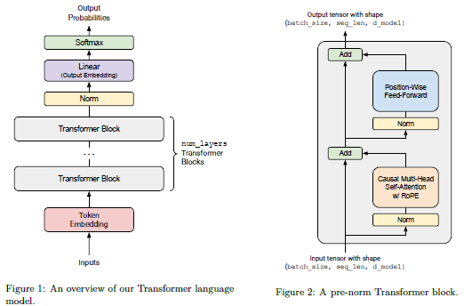

# 2 BPE 分词器

## 2.1 Unicode 标准

**Q1.a**

chr(0) returns '\x00' (其实代表的字符是null）；

**Q1.b**

chr(0) 的字符表示与打印表示不一样，用 repr() 会看到 '\x00'，但是 print() 会看到一个空白；

**Q1.c**

虽然 chr(0) 存在于字符串中，但在打印输出时它是不可见且无宽度的，这会导致前后的文本看起来紧紧相邻，完全掩盖了该字符的存在。

## 2.2 Unicode 编码

**Q2.a**

UTF-8 避免了 UTF-16 和 UTF-32 中常见的冗余零字节填充（尤其是对于 ASCII 字符），这防止了 BPE 浪费词表空间去学习无意义的编码占位模式。此外，UTF-8 作为互联网标准，在处理绝大多数现代语料时更具空间效率，且由于其字节流特性而无需处理大小端序（Endianness）带来的复杂性。

**Q2.b**

示例输入：b'\xe4\xbd\xa0'（汉字“你”的 UTF-8 编码）。由于 UTF-8 是一种变长编码，非 ASCII 字符（如中文或 Emoji）是由 2 到 4 个字节组成的序列，该函数尝试逐个字节地独立解码会破坏编码序列的完整性，导致无法识别多字节字符并抛出 UnicodeDecodeError。

**Q3.c**

示例：b'\xff\xff'。在 UTF-8 编码规范中，字节 0xFF 被明确禁止使用，因为它不符合任何合法的单字节或多字节起始位规则，因此无法与任何字符对应。

## 2.3 字词分词

## 2.4 BPE 分词器训练

词表初始化、预分词、计算 BPE 合并。需要注意特殊Token。

## 2.5 尝试 BPE 分词器训练

我们在 TinyStories 数据集上训练一个字节级 BPE 分词器。代码位于GitHub。

首先实现BPE，**从大量文本中学习出一个词表（Vocabulary）和一组合并规则（Merges）**。我们使用 GPT-2 的预分词规则。此外需要在 Tiny Stories 和 OpenWeb Text 上训练。耗时会比较长。

**Q4**

BPE分词器训练

**Q5**

在 TinyStories 上进行 BPE 训练，耗时 48 分钟（估计是因为后台有别的东西在同时跑），峰值内存 38.8 GB。最长的 token 是 **accomplishment**（15 字节），这是一个常见的英语单词，常出现在儿童故事中表达成就感，完全合理。

**Q6**

在 OpenWebText 上进行 BPE 训练，用一开始的脚本会爆内存，但是我是 coding 苦手，只好让 Claude 帮我优化了（ 优化后的耗时 5.1 小时，内存占用 11.85 GB。最长 token 是 **64 字节的重复 UTF-8 序列 (\xc3\x83\xc3\x82...)**，这实际上是编码错误导致的乱码字符被频繁合并。这在真实网页数据中很常见，说明 OpenWebText 包含一些编码损坏的内容。

## 2.6 BPE 分词器：编码与解码

现在，我们将实现一个 BPE 分词器，它加载提供的词表和合并列表，并使用它们将文本编码为 Token ID 或从 Token ID 解码。

### 2.6.1 编码文本

BPE 编码文本与训练 BPE 词表的过程类似：预分词 - 应用合并。

### 2.6.2 解码文本

**Q7**

实现 tokenizer 。

**Q8.a**

TinyStories tokenizer (10k vocab) 对其验证集的压缩率为 4.03 bytes/token，而 OpenWebText tokenizer (32k vocab) 对 OWT 验证集的压缩率为 4.70 bytes/token。

**Q8.b**

如果使用 TinyStories tokenizer 对 OpenWebText 数据进行分词，压缩率下降为 3.29 bytes/token。这是因为 TinyStories 的词表是针对简单儿童故事优化的，缺乏 OWT 中复杂多样的词汇，导致更多单词被拆解为更碎的字符级 token。

**Q8.c**

分词器的吞吐量约为 1.66 MB/s。按照这个速度，处理 825GB 的 Pile 数据集大约需要 148 小时（约 6.2 天）。

**Q8.d**

uint16 是合适的选择，因为我们的最大词表大小为 32,000，完全在 uint16（0-65535）的表示范围内。相比默认的 int64（8 字节），使用 uint16（2 字节）可以节省 75% 的内存和存储空间，这对于处理数十 GB 的大规模数据集至关重要。

# 3 Transformer

在本部分作业中，将从头开始构建这个 Transformer 语言模型。我们将从模型的高层描述开始，然后逐步详细介绍各个组件。

## 3.1 Transformer LM

Transformer 语言模型使用输入嵌入将 Token ID 转换为稠密向量，将嵌入的 Token 通过 num_layers 个 Transformer 块，然后应用一个学习到的线性投影（“输出嵌入”或“LM Head”）来产生预测的下一个令牌 Logits。

在操作中，我们将使用 Einops 来使我们对于张量的操作更加易读。

**我们在本作业的数学符号中将使用列向量**。

## 3.4 基础构建块：线性层

Q9 实现线性层

Q10 实现 Embedding 层

## 3.5 PreNorm Transformer块

研究发现将归一化移到子层输入端可以显著提高 Transformer 训练过程的稳定性。Pre‑norm 的一个直觉是，从输入嵌入到 Transformer 的最终输出存在一条没有任何归一化的纯净 “残差流”，据称这可以改善梯度流。

Q11 实现 RMSNorm

Q12 实现 SwiGLU 逐位置前馈网络

Q13 实现相对位置嵌入 RoPE

对于位置 $i$ 处的向量，旋转角度为： $$\theta_{i,k} = \frac{i}{\Theta^{(2k-2)/d}} \quad \text{for } k \in {1, ..., d/2}$$

每对元素 $(x_{2k-1}, x_{2k})$ 通过 2×2 旋转矩阵变换：

$$
\begin{bmatrix} x'_{2k-1} \\ x'_{2k} \end{bmatrix} =
\begin{bmatrix}
\cos(\theta_{i,k})  & -\sin(\theta_{i,k})\\
\sin(\theta_{i,k})  & \cos(\theta_{i,k})
\end{bmatrix}
\begin{bmatrix} x_{2k-1} \\ x_{2k} \end{bmatrix}
$$

这里有个坑debug了好久，`torch.einsum` 和 `einops.einsum` 支持的风格不一样，有一处 Antigravity 自动改成了 `torch.einsum` 没注意到一直 debug 不过。。。
