[TOC]

# 1 概述

## 1.1 性能分析和基准测试

### 1.1.1 Setup

### 1.1.2 Model Sizing

### 1.1.3 端到端基准测试

**问题 (benchmarking_script)**

A：一个脚本

B：在 `warmup=5`、`measure=10`、`batch_size=4`、`context_length=256`、`float32` 下，前向平均耗时约为：small **19.15 ms**、medium **50.67 ms**、large **111.76 ms**；反向平均耗时约为：small **36.63 ms**、medium **103.52 ms**（large backward 以及更大模型在本机 32GB 显存下 OOM）。各成功配置的标准差整体较小（约 0.17ms–2.56ms），说明 warmup 后测量波动不大。

C：不做 warmup 时，耗时会明显偏高且波动更大：以 small 为例，前向为 **32.51±40.59 ms**、反向为 **40.40±11.72 ms**，主要是首轮包含了 CUDA 上下文初始化、内存分配器状态建立和内核路径初始化等一次性开销。做 1-2 次 warmup 后结果会改善（例如前向约 20.46/20.20 ms，反向约 36.23/37.23 ms），但仍可能和 5 次 warmup 有差异，因为缓存与执行路径不一定已完全进入稳定状态。warmup 足够后，测得时间更接近稳态吞吐。

###  1.1.4 Nsight Systems 分析器

**问题(nsys_profile)**

A：以 `medium, context_length=256` 为例，nsys 运行下 forward 的均值约为 **25.34 ms**（见 `results/nsys_profile/logs/size-medium_ctx-256_mode-forward.benchmark.json`）；不用 nsys 的 Python 计时约为 **24.74 ms**。两者非常接近（约 2-3% 差异），说明 end-to-end 基准和 nsys 观测基本一致，只存在小幅 profiler 开销。

B：forward 中累计时间最高的 kernel 是 CUTLASS GEMM：`cutlass_80_simt_sgemm_128x256_8x4_tn_align1`（见 `results/nsys_profile/stats/size-medium_ctx-256_mode-forward.stats.txt`）。在 `small/medium/large, ctx=256` 的 profile 中总调用次数分别为 **555/1095/1635**（对应 5 warmup + 10 measured 的总次数），换算单次 forward 约 **37/73/109** 次。在 `forward_backward` 中该 kernel 依然是累计时间第一（同样可见于对应 stats 文件）。

C：除了 GEMM，时间占比明显的还有 `elementwise_kernel` / `vectorized_elementwise_kernel`、`reduce_kernel`、以及 `exp/sigmoid` 等点算子和归约算子（见 `results/nsys_profile/stats/size-medium_ctx-256_mode-forward.stats.txt`）。这些 kernel 单次开销不大，但调用频繁且偏内存访问，累计起来占比不可忽略。

D：以 `medium, ctx=256` 为例，从 `cuda_gpu_kern_sum` 估算，矩阵乘法相关 kernel 占比在 forward-only 约 **81.6%**，在 full train step 约 **65.3%**。这说明训练时除了 GEMM，还增加了较多梯度与优化器相关的 pointwise/reduction 开销。

E：在 self-attention 路径中，softmax 相关 kernel（max/sum/exp/div）总耗时显著低于 matmul（GEMM），数量级上通常只是 GEMM 的小部分。趋势与 FLOPs 认知一致（matmul FLOPs 更大），但 runtime 差异并不完全等于 FLOPs 比例，因为 softmax 更偏 memory-bound，而 matmul 更能利用 Tensor Core 的高吞吐。

### 1.1.5 混合精度

**问题(mixed_precision_accumulation)**

FP32 + FP32 = `10.0001335`，FP16 + FP16 = `9.953125`，FP32 + FP16 = `10.0021362`，FP16 先转 FP32 再累加 = `10.0021362`。可以看出纯 FP16 累加误差最大，因为随着和变大，FP16 尾数精度不足，很多 `+0.01` 会被舍入吞掉；而用 FP32 做累加时精度明显更好。同时，若每一步的加数本身先以 FP16 表示（`0.01` 已量化），即使再转成 FP32 累加也无法恢复这部分量化误差，所以后两种结果基本一致。

**问题(benchmarking_mixed_precision)**

A：

- 模型参数（autocast 上下文内）: `torch.float32`
- `ToyModel.fc1` 输出: `torch.float16`
- `ToyModel.ln` 输出: `torch.float32`
- 模型 logits: `torch.float16`
- loss: `torch.float32`
- 梯度: `torch.float32`

B：LayerNorm 中最敏感的是均值/方差的归约与归一化计算（减均值、平方、求和、`rsqrt`），这些步骤对数值范围和舍入误差都更敏感。FP16 尾数较短且动态范围更窄，容易带来更明显的精度损失，因此通常在更高精度（FP32）里做这类累积/归约。BF16 的动态范围与 FP32 接近，溢出/下溢风险比 FP16 小很多，但尾数仍较短，所以实践中仍常把 LayerNorm 的关键计算保留在 FP32 以保证稳定性。

C：在 `batch_size=4, context_length=256, warmup=5, measure=10` 下，BF16 混合精度相对 FP32 在可运行模型上均明显加速：small 前向 `0.02177s→0.01222s (1.78x)`、反向 `0.03616s→0.02552s (1.42x)`；medium 前向 `1.86x`、反向 `1.69x`；large 前向 `1.71x`、反向 `1.57x`。总体趋势是模型变大后混合精度仍保持稳定收益，且前向提速通常略高于反向。`xl` 和 `2.7b` 在当前显存配置下出现 OOM（两种精度均有），已在结果中记录。

### 1.1.6 内存分析

**问题(memory_profiling)**

A：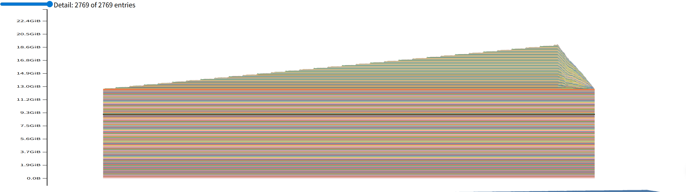

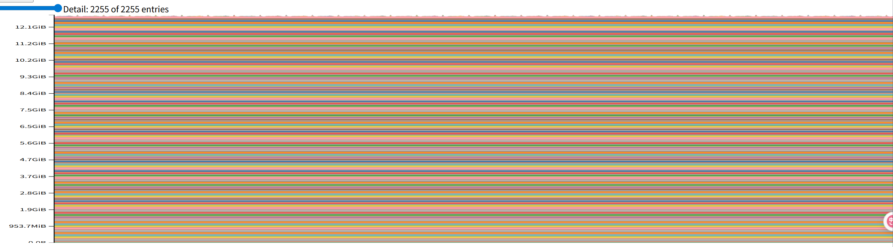

BF16 前向时间线整体呈现较高基线并随序列长度增加而上升，主要由大模型参数常驻显存与激活增长共同决定。对 2.7B 模型做完整训练步时，本机 31.36 GiB 显存无法在题目参考设置下完成运行，因此没有可用的 train-step 时间线图。

FP32 forward 的 active memory timeline 较平稳，不是因为立即 OOM，而是因为 2.7B 参数常驻显存占主导，前向激活增量在 ctx=128 下相对较小。

B：峰值显存表（参考设置，2.7B, FP32）

下表使用 `torch.cuda.max_memory_allocated`（单位 MiB）：

| Context length | 前向峰值 (MiB) | 完整训练步峰值 (MiB) |
| -------------- | -------------: | -------------------: |
| 128            |       13234.02 |                  OOM |
| 256            |       13335.28 |                  OOM |
| 512            |       13750.54 |                  OOM |

前向数据来源：`results/memory_profiling/isolated_ctx*_full/results.json`。

C：在本实验环境中，BF16 autocast 的前向峰值显存高于 FP32 前向：

- ctx=128：FP32 `13234.02 MiB`，BF16 `19600.35 MiB`
- ctx=256：FP32 `13335.28 MiB`，BF16 `19650.28 MiB`
- ctx=512：FP32 `13750.54 MiB`，BF16 `19850.42 MiB`

完整训练步在 FP32 与 BF16 下均 OOM，因此 mixed precision 在该硬件和参考超参数下未能让 2.7B 的 train-step 变为可行。结论是：本机上 mixed precision 明显提升速度，但并未显著降低到可支撑完整训练步的显存水平。

D：残差流激活张量形状为 `[B, T, d_model]`，单精度每元素 4 字节，因此：

`bytes = B * T * d_model * 4`

在参考设置中 `B=4`，2.7B 配置 `d_model=2560`，所以：

- `T=128`：`4*128*2560*4 = 5,242,880 bytes = 5.00 MiB`
- `T=256`：`10.00 MiB`
- `T=512`：`20.00 MiB`

因此本题最大上下文 `T=512` 时，单个残差流激活张量大小为 `20.00 MiB`。

E：使用带栈追踪的前向快照：

- `results/memory_profiling/problem_1_1_6_trace_py/snapshots/size-2.7b_ctx-128_mode-forward_precision-full_fp32.pickle`

可见最大活跃分配块为重复出现的 `100.0 MiB`。栈信息指向 `assignment1-basics/cs336_basics/transformer.py` 的模型构造路径（由 `cs336_systems/benchmarking_script.py` 中 `_build_model` 调用），说明这些最大块主要来自模型参数分配，而不是单步前向中的瞬时激活。

## 1.2 Flash Attention 2 优化注意力

### 1.2.1 Pytorch 注意力基准测试

**问题 (pytorch_attention)**

| d_model | seq_len | status | fwd_mean_ms | bwd_mean_ms | mem_before_bwd_mean_mib | mem_before_bwd_max_mib | peak_allocated_mib |
| ------: | ------: | ------ | ----------: | ----------: | ----------------------: | ---------------------: | -----------------: |
|      16 |     256 | ok     |       4.378 |       4.515 |                   21.46 |                  21.46 |              29.59 |
|      16 |    1024 | ok     |       3.944 |       4.863 |                   91.84 |                  91.84 |             220.34 |
|      16 |    4096 | oom    |           - |           - |                       - |                      - |                  - |
|      16 |    8192 | oom    |           - |           - |                       - |                      - |                  - |
|      16 |   16384 | oom    |           - |           - |                       - |                      - |                  - |
|      32 |     256 | ok     |       4.152 |       4.373 |                   22.09 |                  22.09 |              30.34 |
|      32 |    1024 | ok     |       4.381 |       1.956 |                   94.34 |                  94.34 |             223.34 |
|      32 |    4096 | ok     |      13.417 |      38.595 |                 1204.62 |                1204.62 |            3256.62 |
|      32 |    8192 | oom    |           - |           - |                       - |                      - |                  - |
|      32 |   16384 | oom    |           - |           - |                       - |                      - |                  - |
|      64 |     256 | ok     |       4.483 |       4.392 |                   23.34 |                  23.34 |              31.84 |
|      64 |    1024 | ok     |       3.994 |       4.902 |                   99.34 |                  99.34 |             229.34 |
|      64 |    4096 | oom    |           - |           - |                       - |                      - |                  - |
|      64 |    8192 | oom    |           - |           - |                       - |                      - |                  - |
|      64 |   16384 | oom    |           - |           - |                       - |                      - |                  - |
|     128 |     256 | ok     |       4.490 |       4.490 |                   25.84 |                  25.84 |              34.84 |
|     128 |    1024 | ok     |       4.743 |       4.750 |                  109.34 |                 109.34 |             241.34 |
|     128 |    4096 | ok     |      18.693 |      43.259 |                 1264.62 |                1264.62 |            3328.62 |
|     128 |    8192 | oom    |           - |           - |                       - |                      - |                  - |
|     128 |   16384 | oom    |           - |           - |                       - |                      - |                  - |

## 1.3 JIT编译注意力机制的基准测试

**问题(torch_compile)**

A：

| impl     | d_model | seq_len | status | fwd_ms | bwd_ms | mem_before_bwd_mib | peak_alloc_mib |
| -------- | ------: | ------: | ------ | -----: | -----: | -----------------: | -------------: |
| eager    |      16 |     256 | ok     |  0.076 |  0.219 |              21.46 |          29.59 |
| eager    |      16 |    1024 | ok     |  0.203 |  0.501 |              91.84 |         220.34 |
| eager    |      16 |    4096 | ok     |  5.954 | 12.100 |            1194.61 |        3244.62 |
| eager    |      16 |    8192 | ok     | 23.859 | 47.803 |            4708.96 |       12905.00 |
| eager    |      16 |   16384 | oom    |      - |      - |                  - |              - |
| eager    |      32 |     256 | ok     |  0.077 |  0.236 |              22.08 |         296.50 |
| eager    |      32 |    1024 | ok     |  0.210 |  0.527 |              94.33 |         223.34 |
| eager    |      32 |    4096 | ok     |  6.023 | 12.165 |            1204.59 |        3256.62 |
| eager    |      32 |    8192 | ok     | 24.162 | 48.145 |            4728.92 |       12929.00 |
| eager    |      32 |   16384 | oom    |      - |      - |                  - |              - |
| eager    |      64 |     256 | ok     |  0.077 |  0.240 |              23.33 |         320.75 |
| eager    |      64 |    1024 | ok     |  0.221 |  0.539 |              99.32 |         229.34 |
| eager    |      64 |    4096 | ok     |  6.185 | 12.524 |            1224.55 |        3280.62 |
| eager    |      64 |    8192 | ok     | 24.803 | 49.182 |            4768.84 |       12977.00 |
| eager    |      64 |   16384 | oom    |      - |      - |                  - |              - |
| eager    |     128 |     256 | ok     |  0.085 |  0.194 |              25.83 |         369.25 |
| eager    |     128 |    1024 | ok     |  0.290 |  0.649 |             109.30 |         241.34 |
| eager    |     128 |    4096 | ok     |  7.177 | 14.353 |            1264.46 |        3328.62 |
| eager    |     128 |    8192 | ok     | 28.899 | 56.433 |            4848.68 |       13073.00 |
| eager    |     128 |   16384 | oom    |      - |      - |                  - |              - |
| compiled |      16 |     256 | ok     |  0.038 |  0.142 |              20.97 |         464.38 |
| compiled |      16 |    1024 | ok     |  0.105 |  0.252 |              83.87 |         308.38 |
| compiled |      16 |    4096 | ok     |  1.757 |  4.534 |            1066.73 |        2092.75 |
| compiled |      16 |    8192 | ok     |  8.344 | 18.141 |            4197.21 |        8297.25 |
| compiled |      16 |   16384 | oom    |      - |      - |                  - |              - |
| compiled |      32 |     256 | ok     |  0.049 |  0.104 |              21.59 |         296.50 |
| compiled |      32 |    1024 | ok     |  0.126 |  0.367 |              86.36 |         151.38 |
| compiled |      32 |    4096 | ok     |  2.409 |  5.434 |            1076.71 |        2104.75 |
| compiled |      32 |    8192 | ok     | 10.077 | 21.681 |            4217.17 |        8321.25 |
| compiled |      32 |   16384 | oom    |      - |      - |                  - |              - |
| compiled |      64 |     256 | ok     |  0.053 |  0.151 |              22.84 |         320.75 |
| compiled |      64 |    1024 | ok     |  0.136 |  0.412 |              91.36 |         157.38 |
| compiled |      64 |    4096 | ok     |  2.575 |  5.782 |            1096.67 |        2128.75 |
| compiled |      64 |    8192 | ok     | 10.831 | 22.804 |            4257.09 |        8369.25 |
| compiled |      64 |   16384 | oom    |      - |      - |                  - |              - |
| compiled |     128 |     256 | ok     |  0.054 |  0.123 |              25.33 |         369.25 |
| compiled |     128 |    1024 | ok     |  0.209 |  0.545 |             101.33 |         169.38 |
| compiled |     128 |    4096 | ok     |  3.669 |  7.782 |            1136.59 |        2176.75 |
| compiled |     128 |    8192 | ok     | 15.563 | 30.814 |            4336.93 |        8465.25 |
| compiled |     128 |   16384 | oom    |      - |      - |                  - |              - |

- 在可运行配置上，`torch.compile` 对 attention 前向与反向均有稳定加速。
- 例如 `d_model=128, seq_len=8192`：
  - forward: `28.899 ms -> 15.563 ms`（约 `1.86x`）
  - backward: `56.433 ms -> 30.814 ms`（约 `1.83x`）
- 对更短序列（如 `seq_len=256/1024`）也有加速；`seq_len=16384` 在两种实现下均 OOM。

B：

| impl     | size   | mode             | status | mean_ms | peak_alloc_mib |
| -------- | ------ | ---------------- | ------ | ------: | -------------: |
| eager    | small  | forward          | ok     |  10.051 |         573.75 |
| eager    | small  | forward_backward | ok     |  29.049 |        2051.62 |
| eager    | small  | train_step       | ok     |  35.523 |        3081.32 |
| eager    | medium | forward          | ok     |  25.888 |        1718.15 |
| eager    | medium | forward_backward | ok     |  79.947 |        5463.15 |
| eager    | medium | train_step       | ok     | 101.238 |        8695.53 |
| eager    | large  | forward          | ok     |  56.785 |        3930.37 |
| eager    | large  | forward_backward | ok     | 171.433 |       10855.63 |
| eager    | large  | train_step       | ok     | 218.494 |       19088.58 |
| compiled | small  | forward          | ok     |   8.056 |         553.59 |
| compiled | small  | forward_backward | ok     |  23.580 |        1739.86 |
| compiled | small  | train_step       | ok     |  29.901 |        2699.30 |
| compiled | medium | forward          | ok     |  21.414 |        1789.96 |
| compiled | medium | forward_backward | ok     |  66.816 |        4561.65 |
| compiled | medium | train_step       | ok     |  87.537 |        8138.72 |
| compiled | large  | forward          | ok     |  47.927 |        3996.15 |
| compiled | large  | forward_backward | ok     | 143.666 |        9127.39 |
| compiled | large  | train_step       | ok     | 192.622 |       19087.58 |

- `torch.compile(model)` 对 end-to-end 性能有一致提升（forward / forward_backward / train_step 均变快）。
- 代表性数据：
  - **small, train_step**: `35.523 ms -> 29.901 ms`（约 `1.19x`）
  - **medium, train_step**: `101.238 ms -> 87.537 ms`（约 `1.16x`）
  - **large, train_step**: `218.494 ms -> 192.622 ms`（约 `1.13x`）
- 对 forward-only 同样有提升（例如 large: `56.785 ms -> 47.927 ms`，约 `1.18x`）。

### 1.3.1 示例：WeightedSum

### 1.3.2 Flash Attention2 前向传播

在这里建议先看一下 Flash Attention V1 内容，有助于理解：

> 引言
> --
>
> 最近面试又被拷打了一下，才发现之前对于FlashAttention学习的太浅，这篇文章重点来讲一下这几个问题：
>
> 1、FlashAttention算法的核心思想是什么？
>
> 2、FlashAttention切分的是什么维度？怎样切分能更好的利用SM？
>
> 3、在prefill阶段和decode阶段有什么不同的优化点？
>
> 个人理解学习FlashAttention要先从online softmax入手，理解了公式的推导过程之后，再结合代码，看看共享内存和全局内存实际储存了哪些矩阵，外循环和内循环的区别，计算N\*d的Q、K、V矩阵一共需要循环几次。之后再看看FlashAttention-2提出了哪些提升。本文不涉及3、4的改进。
>
> FlashAttention-1算法
> ------------------
>
> 标准的缩放点积注意力（[Scaled Dot-Product Attention](https://zhida.zhihu.com/search?content_id=271325821&content_type=Article&match_order=1&q=Scaled+Dot-Product+Attention&zhida_source=entity)）公式如下：
>
> $$
> \mathrm{Attention}(Q, K, V) = \mathrm{Softmax}\left(\frac{QK^T}{\sqrt{d_k}}\right)V
> $$
>
> 在硬件执行层面，这个公式通常被分解为以下步骤：
>
> 1.  计算分数：\( $S = QK^T \in \mathbb{R}^{N \times N}$ \)，N为序列长度
> 2.  缩放与掩码：\( $S_{\text{scaled}} = \frac{S}{\sqrt{d_k}}$ \)，k为\( $d_{\text{model}} / n_{\text{head}}$ \)
> 3.  计算权重：\( $P = \mathrm{Softmax}(S_{\text{scaled}}) \in \mathbb{R}^{N \times N}$ \)
> 4.  加权求和：\( $O = PV \in \mathbb{R}^{N \times d}$ \)
>
> 在标准实现中，\( S \) 和 \( P \) 的矩阵大小是 \( $N \times N$ \)。当序列长度 \( N = 64k \) 时，这个中间矩阵会占用巨大的显存，且频繁地在 GPU 高速显存（HBM）和计算单元（SRAM）之间来回读写，导致计算单元大部分时间在等待数据传输。
>
> Flash Attention 并不改变公式的数学结果，而是改变了计算过程。它主要通过两个手段：
>
> 1.  Tiling（分块）：将大矩阵拆分成小块，使其能放入 SRAM（极快但空间小的片上缓存）。
> 2.  算子融合（Kernel Fusion）：在一个 GPU Kernel 中完成所有计算，不再写回中间矩阵 \( S \) 和 \( P \)
>
> 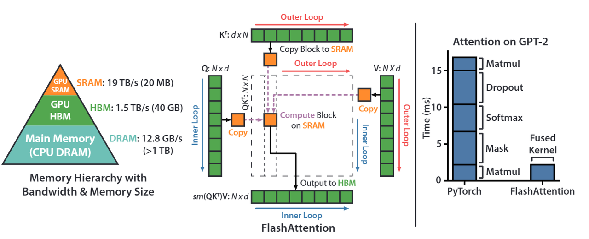  
>
> > [FlashAttention](https://link.zhihu.com/?target=https%3A//arxiv.org/abs/2205.14135) 是一种重新排序注意力计算并利用分块和重新计算来显著加速并减少内存使用（从序列长度的二次方降至线性）的算法。我们使用分块将输入块从 HBM（GPU 内存）加载到 SRAM（快速缓存），对该块执行注意力计算，并更新 HBM 中的输出。通过不将大型中间注意力矩阵写入 HBM，我们减少了内存读写量，从而使实际时间加快 2-4 倍。
>
> 此处展示了 FlashAttention 正向传播的示意图：通过分块和 softmax 重缩放，我们以块为单位进行操作，避免从 HBM 读取/写入，同时获得正确的输出而没有近似值。
>
> 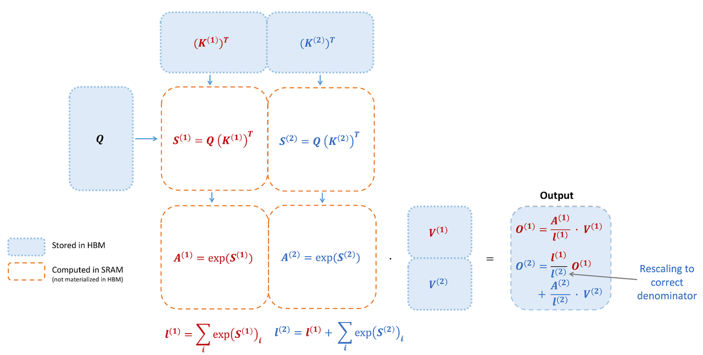  
>
> 实现分块计算最大的难点在于 **Softmax，因为**要计算序列中任意一个位置的 Softmax 值，你必须先知道**整个序列**中的最大值和所有数值的指数和。
>
> ### online softmax
>
> Native softmax
>
> 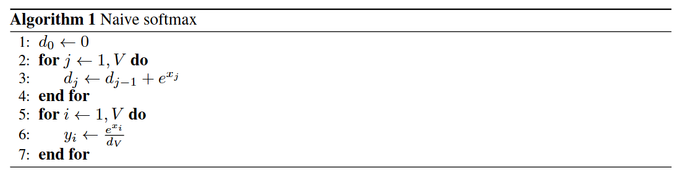  
>
> 由于在实际的计算中，指数计算exp存在不稳定性，比如数值容易溢出，超过一定范围计算精度会下降等问题  
>
> **Safe softmax**
>
> 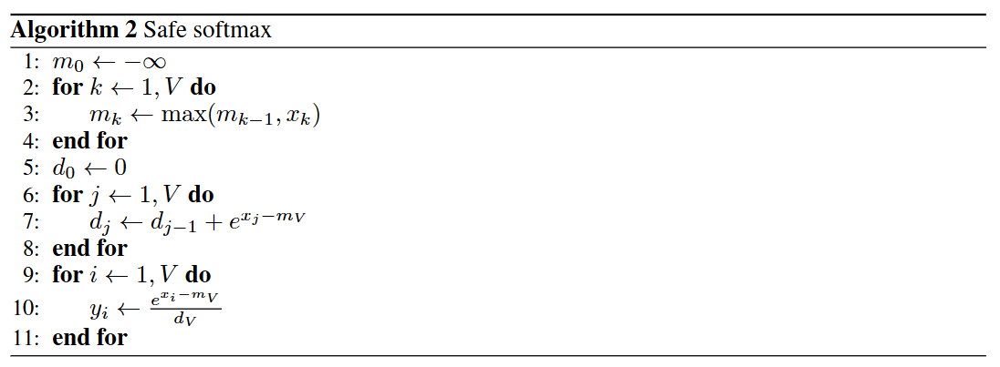  
>
> 计算时每个数减去数组中的最大值，与Naive版本相比，不会出现数值溢出，但是多了一次寻找最大值的遍历。一共需要三次遍历。  
>
> **Online softmax**  
>
> Online Softmax 提出了一种**增量更新**的策略。具体实现策略如下：
>
> 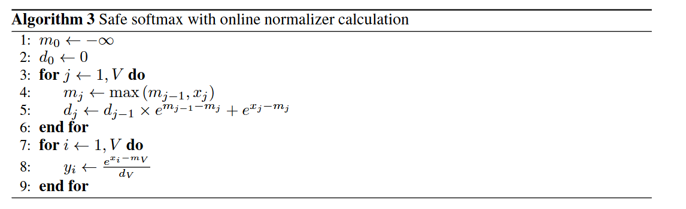  
>
> 使得我们可以在不知道全局最大值的情况下，开始计算和存储中间结果。允许将巨大的 Attention 矩阵切分成小块放入 SRAM（共享内存）中计算，这是**FlashAttention**能够减少显存访问（HBM Access）并提升速度的数学基础。
>
> ### 算法流程
>
> **FlashAttention-1其实是按照 batch 和 Heads 维度做并行的，每个block计算一个\[N,head\_dim\]的Q、K、V矩阵的attention计算结果**
>
> 由下图可以清晰的看到计算过程中每个分块的大小
>
> 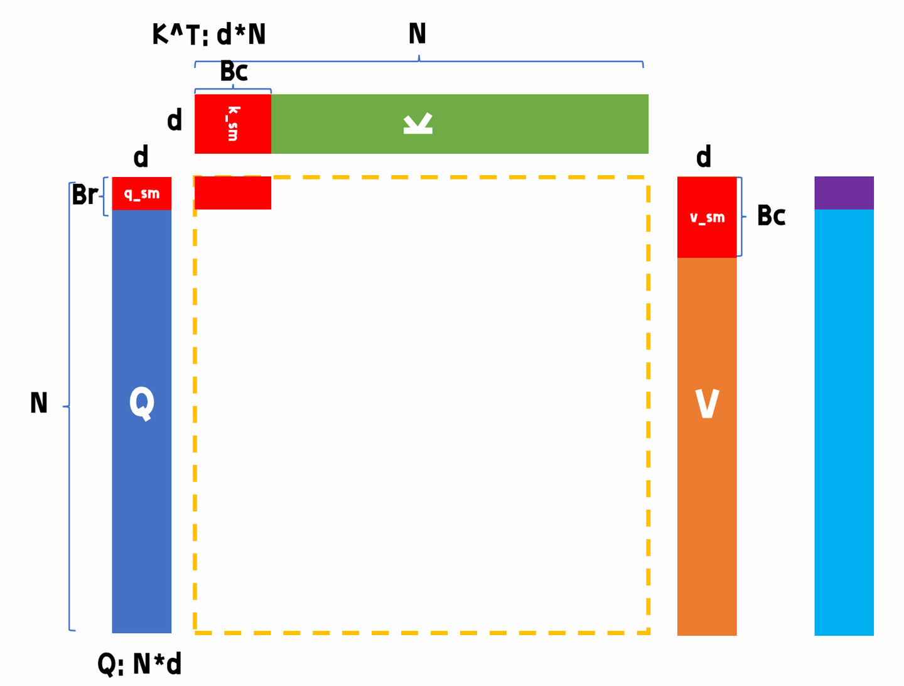  
>
> 图片来源：B站@比飞鸟贵重的多_HKL
>
> 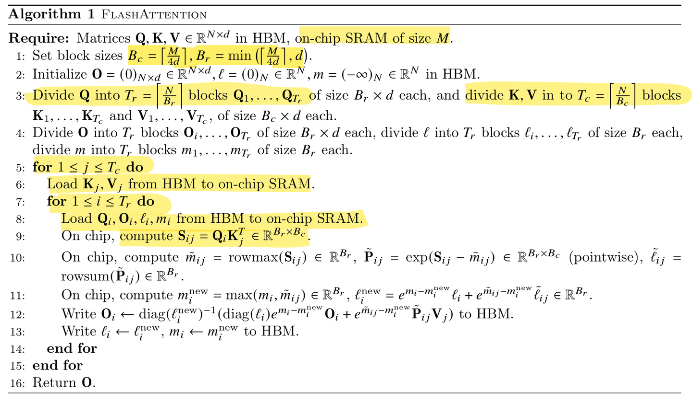  
>
> 关键变量定义：
>
> *   \( $m^{(i)}$ \)：当前行到第 \( i \) 步时的最大值（用于数值稳定性）。
> *   \( $l^{(i)}$ \)：当前行到第 \( i \) 步时的指数累加和（归一化因子）。
> *   \( $O^{(i)}$ \)：当前行到第 \( i \) 步时的部分注意力输出结果。
>
> 这三个变量与online softmax有关，储存在全局内存中
>
> `tile_size = Bc * d`：每个分块（`Qi`、`Kj`、`Vj`、`S`）占用的共享内存大小
>
> 其中S是得分矩阵，由于要继续和V进行运算，所以存储在共享内存中，减少读写次数
>
> Bc和Br的值根据共享内存大小确定，保证`tile_size * 4 < M`
>
> Q矩阵块\[Br, d\]，所以一共要循环 \( $T_r = N / B_r$ \) 次
>
> K,V矩阵块\[Bc, d\]，所以一共要循环 \( $T_c = N / B_c$ \) 次
>
> 上述计算循环的总次数为
>
> $$
> T_c T_r = \left\lceil \frac{N}{B_c} \right\rceil \left\lceil \frac{N}{B_r} \right\rceil
> $$
>
> 因此总的FLOPs为：
>
> $$
> O\left(\frac{N^2}{B_c B_r} \cdot B_r B_c d\right) = O(N^2 d)
> $$
>
> FlashAttention-2
> ----------------
>
> 相比于 FA1，FA2 的改进主要集中在**并行维度**、**算法开销**和**任务划分**这三大块：
>
> ### **减少非矩阵乘法（Non-matmul）开销**
>
> GPU 最擅长做矩阵乘法（Matmul），而做指数运算、缩放等操作相对较慢。
>
> 公式优化： FA2 改进了在线 Softmax（Online Softmax）的计算逻辑。在 FA1 中，每一步循环都要对输出 \( O \) 进行重缩放。FA2 则通过数学技巧，将部分缩放操作移到了循环结束处，减少了大量不必要的计算。
>
> **1、去掉了什么缩放？**
>
> 在 FA1 的内循环中，每次计算出一个新的块注意力后，都会对历史输出 \( $O^{(i-1)}$ \) 进行一次极其繁琐的缩放。
>
> 具体来说，FA1 会在每次迭代时，乘以旧的局部指数和 \( $l^{(i-1)}$ \)，再除以新的局部指数和 \( $l^{(i)}$ \)。
>
> FA2 去掉的正是这个「除以 \( $l^{(i)}$ \)」和「乘以 \( $l^{(i-1)}$ \)」的中间归一化步骤。
>
> **2、为什么能去掉？**
>
> 这得益于 FA2 **改变了循环的嵌套顺序**：
>
> *   **FA1 的循环顺序：** 外循环是 K, V，内循环是 Q, O。因为 O 在内循环中会被不断换入换出显存（HBM），为了保证写入 HBM 的数据不会因为数值过大而溢出，且符合标准的 Attention 定义，FA1 选择每次都把 O 算成**已经归一化**的最终形态写回 HBM。
> *   **FA2 的循环顺序：** 外循环是 Q, O，内循环是 K, V。在这个设计下，当前处理的 Q 块和它的输出结果 O 会一直停留在超快的 SRAM 和寄存器中，直到遍历完所有的 K, V 才写回显存。
> *   **结论：** 既然中间结果不需要写回显存，我们完全可以在寄存器里维护一个未归一化（Unnormalized）的中间累加值，等所有循环跑完，最后再做一次除法进行归一化即可。
>
> **3、数学推导**
>
> 为了防止指数爆炸，我们维护两个全局变量（也就是之前代码里的 m 和 l）：
>
> 全局最大值更新：
>
> $$
> m^{(i)} = \max(m^{(i-1)}, m_i)
> $$
>
> 全局分母（指数和）更新：
>
> $$
> l^{(i)} = l^{(i-1)} e^{m^{(i-1)} - m^{(i)}} + e^{S_i - m^{(i)}}
> $$
>
> FlashAttention-1 的更新公式（繁琐缩放）
>
> $$
> O^{(i)} = \frac{1}{l^{(i)}} \left( l^{(i-1)} e^{m^{(i-1)} - m^{(i)}} O^{(i-1)} + e^{S_i - m^{(i)}} V_i \right)
> $$
>
> 可以看到，在每次循环里，GPU 都必须执行一次除以 \( $l^{(i)}$ \) 的操作。除法在 GPU 中是非常消耗时钟周期的。
>
> 在 FA2 中，我们不再维护归一化的 \( $O^{(i)}$ \)，而是引入一个未归一化的中间变量 \( $\tilde{O}^{(i)}$ \)。
>
> 定义 \( $\tilde{O}^{(i)} = l^{(i)} O^{(i)}$ \)。 我们将 \( $\tilde{O}^{(i)}$ \) 代入上面的公式，两边同时乘以 \( $l^{(i)}$ \)，奇迹就发生了：
>
> $$
> \tilde{O}^{(i)} = \tilde{O}^{(i-1)} e^{m^{(i-1)} - m^{(i)}} + e^{S_i - m^{(i)}} V_i
> $$
>
> 推导结果：
>
> 内循环中： 我们只需要用极简的加法和乘法更新 \( $\tilde{O}^{(i)}$ \)，完全去掉了除以 \( $l^{(i)}$ \) 和乘以 \( $l^{(i-1)}$ \) 的操作。
>
> 循环结束后（走出内循环）： 当遍历完所有的 K, V 块后（假设共有 T 个块），我们手里拿到了最终的未归一化结果 \( $\tilde{O}^{(T)}$ \) 和最终的分母 \( $l^{(T)}$ \)。
>
> 此时，只需做唯一一次除法：
>
> $$
> O = \frac{\tilde{O}^{(T)}}{l^{(T)}}
> $$
>
> ### 算法流程
>
> 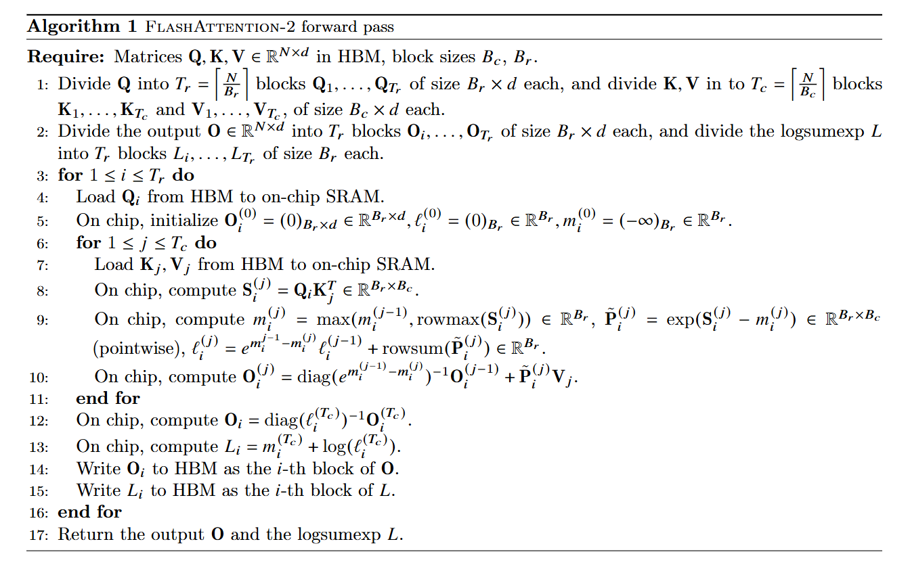  
>
> ### 更强的并行化
>
> *   **FA1 的局限：** 主要在 Batch（批次）和 Heads（头数）维度上并行。如果 Batch 很小或者 Head 很少（比如在处理超长文本时），GPU 的成千上万个核心就会“闲死”。
> *   **FA2 的改进：** 在 **Batch (B)**、**Head (H)** 的基础上，新增了 **序列维度 (N)** 的并行。即使只有 1 个 Head，FA2 也能把长序列拆成多个块，分给不同的 GPU 流处理器（SM）去跑，大幅提高了 GPU 的“满载率”。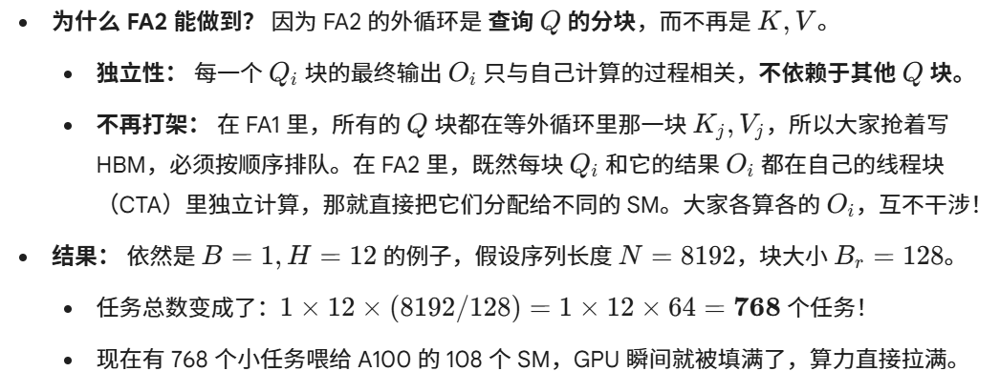  
>
> ### **优化 Warp 级任务划分**
>
> 在 GPU 内部，32 个线程组成一个 Warp。FA2 重新设计了 Warp 之间的分工，减少了它们通过共享显存（Shared Memory）交换数据的次数，从而降低了通信延迟。
>
> 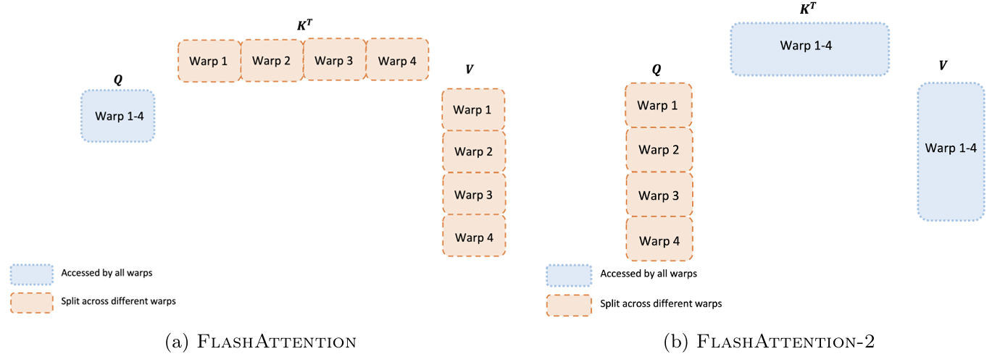  
>
> [Flash-Decoding](https://zhida.zhihu.com/search?content_id=271325821&content_type=Article&match_order=1&q=Flash-Decoding&zhida_source=entity)
> ---------------------------------------------------------------------------------------------------------------------------------------------
>
> 参考文章：[FlashAttenion-V3: Flash Decoding详解 - 知乎](https://zhuanlan.zhihu.com/p/661478232)
>
> 上面提到FlashAttention对batch size和query length进行了并行化加速，Flash-Decoding在此基础上增加了一个新的并行化维度：keys/values的序列长度。即使batch size很小，但只要上下文足够长，它就可以充分利用GPU。
>
> 与FlashAttention类似，Flash-Decoding几乎不用额外存储大量数据到全局内存中，从而减少了内存开销。
>
> 在训练（Prefill）阶段，Q 是一个长矩阵，我们可以像上一节说的那样在 Q 的序列维度上并行。但在 Decoding（生成） 阶段，每次只输入 1 个 Token，这意味着 Q 的长度 \( $N_q = 1$ \)。
>
> 在 FA2 中，并行度主要来自 Batch \* Heads \* (\( $N_q / B_r$ \))。由于 \( $N_q = 1$ \)，分块数变成了 1，导致并行任务数骤降。当 [KV Cache](https://zhida.zhihu.com/search?content_id=271325821&content_type=Article&match_order=1&q=KV+Cache&zhida_source=entity) 非常长（比如 128K）时，GPU 绝大部分时间都在从显存里搬运那巨大的 K, V 矩阵，而计算逻辑却只能在一个 SM 上跑。
>
> Flash-Decoding 的核心优化：KV 维度并行化 Flash-Decoding 引入了“分而治之”的思想，将 KV Cache 沿序列长度方向切开，强行增加并行度。
>
> 它的三步走流程：
>
> 1.  拆分 (Split)：将超长的 KV Cache 拆成若干个较小的块（比如每块 1024 个 Token）。
> 2.  局部计算 (Partial Attention)：启动多个线程块，每个线程块负责计算 Q 与其对应 KV 块的注意力。每个块会计算出一个局部的输出 \( $\tilde{O}_i$ \)、局部最大值 \( $m_i$ \) 和指数和 \( $l_i$ \)。
> 3.  最终聚合 (Reduction)：通过一个极小的内核（Log-sum-exp 减法），将所有局部结果合而为一，生成最终的 Token。
>
> 第一步：寻找全局最大值 (Global Max)
>
> $$
> M = \max(m_1, m_2, \dots, m_S)
> $$
>
> 第二步：统一量纲（Rescaling）
>
> $$
> L_i = l_i \cdot e^{m_i - M}
> = \left( \sum e^{S_{ij} - m_i} \right) \cdot e^{m_i - M}
> = \sum e^{S_{ij} - M}
> $$
>
> $$
> \hat{O}_i = \tilde{O}_i \cdot e^{m_i - M}
> = \left( \sum e^{S_{ij} - m_i} \cdot V_j \right) \cdot e^{m_i - M}
> = \sum e^{S_{ij} - M} \cdot V_j
> $$
>
> 第三步：全局求和与归一化
>
> $$
> L = \sum_{i=1}^{S} L_i
> $$
>
> $$
> \tilde{O}_{\text{global}} = \sum_{i=1}^{S} \hat{O}_i
> $$
>
> $$
> O = \frac{\tilde{O}_{\text{global}}}{L}
> = \frac{\sum_{i=1}^{S} \tilde{O}_i \cdot e^{m_i - M}}{\sum_{i=1}^{S} l_i \cdot e^{m_i - M}}
> $$
>
> 针对 Decode 阶段的好处：
>
> *   速度极大提升：在长文本推理下，Flash-Decoding 比 FA2 快了 8-10 倍。
> *   突破显存带宽瓶颈：通过增加并行度，让更多的 SM 参与搬运和计算，更接近 GPU 的理论带宽极限。
>
> > 作者：砂川同学
> >
> > 链接：[ AI Infra面试常考—FlashAttention系列 - 知乎](https://zhuanlan.zhihu.com/p/2015196808893192187)

以及：

[让深度学习从第一原则开始 - 知乎](https://zhuanlan.zhihu.com/p/692769091)

[图解大模型计算加速系列：FlashAttention V1，从硬件到计算逻辑 - 知乎](https://zhuanlan.zhihu.com/p/669926191)

[图解大模型计算加速系列：Flash Attention V2，从原理到并行计算 - 知乎](https://zhuanlan.zhihu.com/p/691067658)

我们需要理解标准注意力的低效。FlashAttention的主要目标在于避免将注意力矩阵从高带宽内存（HBM）中反复读写，从而降低I/O开销与峰值内存占
用。我们通过三种技术实现这一目标：分块（tiling）、重计算（recomputation）与算子融合（operator fusion）。

**问题(flash_forward)、(flash_backward)、(flash_benchmarking)**

| impl | dtype | d_model | seq_len | status | fwd_ms | bwd_ms | fwd_bwd_ms |
|---|---|---:|---:|---|---:|---:|---:|
| flash | bfloat16 | 16 | 128 | ok | 0.006 | 0.052 | 0.058 |
| pytorch | bfloat16 | 16 | 128 | ok | 0.036 | 0.076 | 0.174 |
| flash | bfloat16 | 16 | 512 | ok | 0.014 | 0.057 | 0.078 |
| pytorch | bfloat16 | 16 | 512 | ok | 0.052 | 0.088 | 0.179 |
| flash | bfloat16 | 16 | 2048 | ok | 0.057 | 0.116 | 0.160 |
| pytorch | bfloat16 | 16 | 2048 | ok | 0.082 | 0.164 | 0.261 |
| flash | bfloat16 | 16 | 8192 | ok | 0.182 | 1.868 | 2.141 |
| pytorch | bfloat16 | 16 | 8192 | ok | 1.690 | 3.517 | 5.246 |
| flash | bfloat16 | 16 | 16384 | ok | 0.553 | 7.378 | 8.046 |
| pytorch | bfloat16 | 16 | 16384 | ok | 7.174 | 14.497 | 22.141 |
| flash | bfloat16 | 16 | 32768 | ok | 2.163 | 29.690 | 31.662 |
| pytorch | bfloat16 | 16 | 32768 | ok | 29.442 | 57.138 | 83.232 |
| flash | bfloat16 | 16 | 65536 | oom | - | - | - |
| pytorch | bfloat16 | 16 | 65536 | oom | - | - | - |
| flash | bfloat16 | 64 | 128 | ok | 0.023 | 0.060 | 0.078 |
| pytorch | bfloat16 | 64 | 128 | ok | 0.033 | 0.062 | 0.176 |
| flash | bfloat16 | 64 | 512 | ok | 0.083 | 0.066 | 0.142 |
| pytorch | bfloat16 | 64 | 512 | ok | 0.037 | 0.082 | 0.191 |
| flash | bfloat16 | 64 | 2048 | ok | 0.319 | 0.216 | 0.606 |
| pytorch | bfloat16 | 64 | 2048 | ok | 0.108 | 0.210 | 0.288 |
| flash | bfloat16 | 64 | 8192 | ok | 1.230 | 2.975 | 4.088 |
| pytorch | bfloat16 | 64 | 8192 | ok | 1.696 | 3.637 | 5.225 |
| flash | bfloat16 | 64 | 16384 | ok | 4.993 | 11.155 | 15.274 |
| pytorch | bfloat16 | 64 | 16384 | ok | 7.854 | 14.445 | 18.888 |
| flash | bfloat16 | 64 | 32768 | ok | 18.366 | 45.108 | 64.434 |
| pytorch | bfloat16 | 64 | 32768 | ok | 29.407 | 57.813 | 84.349 |
| flash | bfloat16 | 64 | 65536 | oom | - | - | - |
| pytorch | bfloat16 | 64 | 65536 | oom | - | - | - |
| flash | bfloat16 | 128 | 128 | oom | - | - | - |
| pytorch | bfloat16 | 128 | 128 | ok | 0.035 | 0.075 | 0.168 |
| flash | bfloat16 | 128 | 512 | oom | - | - | - |
| pytorch | bfloat16 | 128 | 512 | ok | 0.049 | 0.075 | 0.178 |
| flash | bfloat16 | 128 | 2048 | oom | - | - | - |
| pytorch | bfloat16 | 128 | 2048 | ok | 0.102 | 0.211 | 0.280 |
| flash | bfloat16 | 128 | 8192 | oom | - | - | - |
| pytorch | bfloat16 | 128 | 8192 | ok | 1.755 | 3.679 | 5.425 |
| flash | bfloat16 | 128 | 16384 | oom | - | - | - |
| pytorch | bfloat16 | 128 | 16384 | ok | 7.165 | 14.633 | 22.975 |
| flash | bfloat16 | 128 | 32768 | oom | - | - | - |
| pytorch | bfloat16 | 128 | 32768 | ok | 29.677 | 54.701 | 87.923 |
| flash | bfloat16 | 128 | 65536 | oom | - | - | - |
| pytorch | bfloat16 | 128 | 65536 | oom | - | - | - |
| flash | float32 | 16 | 128 | ok | 0.009 | 0.053 | 0.062 |
| pytorch | float32 | 16 | 128 | ok | 0.035 | 0.083 | 0.158 |
| flash | float32 | 16 | 512 | ok | 0.019 | 0.063 | 0.072 |
| pytorch | float32 | 16 | 512 | ok | 0.041 | 0.095 | 0.226 |
| flash | float32 | 16 | 2048 | ok | 0.087 | 0.198 | 0.284 |
| pytorch | float32 | 16 | 2048 | ok | 0.151 | 0.258 | 0.361 |
| flash | float32 | 16 | 8192 | ok | 0.314 | 2.678 | 3.225 |
| pytorch | float32 | 16 | 8192 | ok | 3.357 | 7.022 | 10.520 |
| flash | float32 | 16 | 16384 | ok | 1.079 | 10.802 | 11.771 |
| pytorch | float32 | 16 | 16384 | ok | 14.127 | 28.281 | 43.209 |
| flash | float32 | 16 | 32768 | ok | 3.957 | 41.382 | 48.343 |
| pytorch | float32 | 16 | 32768 | oom | - | - | - |
| flash | float32 | 16 | 65536 | oom | - | - | - |
| pytorch | float32 | 16 | 65536 | oom | - | - | - |
| flash | float32 | 64 | 128 | ok | 0.036 | 0.062 | 0.107 |
| pytorch | float32 | 64 | 128 | ok | 0.049 | 0.079 | 0.201 |
| flash | float32 | 64 | 512 | ok | 0.130 | 0.054 | 0.158 |
| pytorch | float32 | 64 | 512 | ok | 0.050 | 0.088 | 0.167 |
| flash | float32 | 64 | 2048 | ok | 0.459 | 0.141 | 0.644 |
| pytorch | float32 | 64 | 2048 | ok | 0.154 | 0.358 | 0.383 |
| flash | float32 | 64 | 8192 | ok | 1.748 | 2.046 | 3.839 |
| pytorch | float32 | 64 | 8192 | ok | 3.483 | 7.090 | 10.553 |
| flash | float32 | 64 | 16384 | ok | 7.313 | 7.897 | 15.004 |
| pytorch | float32 | 64 | 16384 | ok | 14.287 | 26.462 | 41.227 |
| flash | float32 | 64 | 32768 | ok | 26.596 | 33.306 | 60.283 |
| pytorch | float32 | 64 | 32768 | oom | - | - | - |
| flash | float32 | 64 | 65536 | oom | - | - | - |
| pytorch | float32 | 64 | 65536 | oom | - | - | - |
| flash | float32 | 128 | 128 | oom | - | - | - |
| pytorch | float32 | 128 | 128 | ok | 0.047 | 0.080 | 0.173 |
| flash | float32 | 128 | 512 | oom | - | - | - |
| pytorch | float32 | 128 | 512 | ok | 0.048 | 0.085 | 0.167 |
| flash | float32 | 128 | 2048 | oom | - | - | - |
| pytorch | float32 | 128 | 2048 | ok | 0.180 | 0.378 | 0.528 |
| flash | float32 | 128 | 8192 | oom | - | - | - |
| pytorch | float32 | 128 | 8192 | ok | 3.695 | 7.389 | 11.299 |
| flash | float32 | 128 | 16384 | oom | - | - | - |
| pytorch | float32 | 128 | 16384 | ok | 15.105 | 30.137 | 43.772 |
| flash | float32 | 128 | 32768 | oom | - | - | - |
| pytorch | float32 | 128 | 32768 | oom | - | - | - |
| flash | float32 | 128 | 65536 | oom | - | - | - |
| pytorch | float32 | 128 | 65536 | oom | - | - | - |

# 2 分布式数据并行训练

## 2.1 PyTorch 中的单节点分布式通信

## 2.1.1 分布式应用程序基准测试的最佳实践

**问题：distributed_communication_single_node**

| backend | device | world_size | size_mb | status | mean_ms | std_ms | min_ms | max_ms |
|---|---|---:|---:|---|---:|---:|---:|---:|
| gloo | cpu | 2 | 1 | ok | 0.536 | 0.007 | 0.532 | 0.541 |
| nccl | cuda | 2 | 1 | ok | 0.069 | 0.000 | 0.069 | 0.069 |

## 2.2 分布式数据并行训练的朴素实现

**问题：naive_ddp**

**问题：naive_ddp_benchmarking**

- 在单机 2 GPU（NCCL）下，naive DDP 每步训练时间可分解为计算与逐参数 all-reduce 通信两部分；在当前可运行配置中，通信时间占比约 `64.33%`，说明逐参数同步的通信开销非常显著。
- 该结果与 naive DDP 的预期一致：每个参数都单独触发 all-reduce，导致通信调用频繁、总开销偏高。

| model_size | world_size | dtype   | global_bs | local_bs | context_len | step_mean_ms | comm_mean_ms | comm_ratio_% |
| ---------- | ---------: | ------- | --------: | -------: | ----------: | -----------: | -----------: | -----------: |
| small      |          2 | float32 |         4 |        2 |         128 |      144.568 |       93.748 |        64.33 |

## 2.3 改进最小DDP实现

### 2.3.1 减少通信量的调用

**问题：minimal_ddp_flat_benchmarking**

- 与逐参数 all-reduce 相比，flatten 后单次 batched all-reduce 明显减少通信调用开销，在本次测量中将通信时间从 `116.4 ms` 降到 `77.8 ms`，通信占比从 `68.5%` 降到 `60.7%`。
- 对应地每步训练时间从 `167.1 ms` 降到 `127.3 ms`，验证了“减少通信调用次数”对 minimal DDP 性能的直接收益。

### 2.3.2 重叠计算与个体参数梯度通信

**问题：ddp_overlap_individual_parameters、ddp_overlap_individual_parameters_benchmarking**

- 与 naive per-parameter DDP 相比，overlap_individual 显著减少了 backward 结束后的梯度同步尾部等待，在本次测量中从约 87.5 ms 降到 3.0 ms。  
- 不过由于它仍然执行大量小粒度 all-reduce，单步总时间不一定优于 flatten 方案，这也是后续 bucketed overlap 继续优化的动机。

