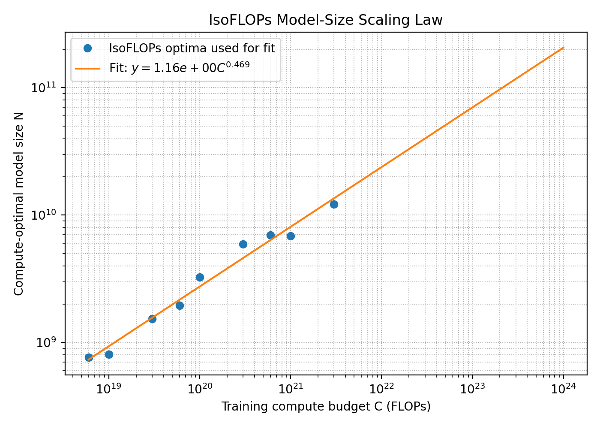
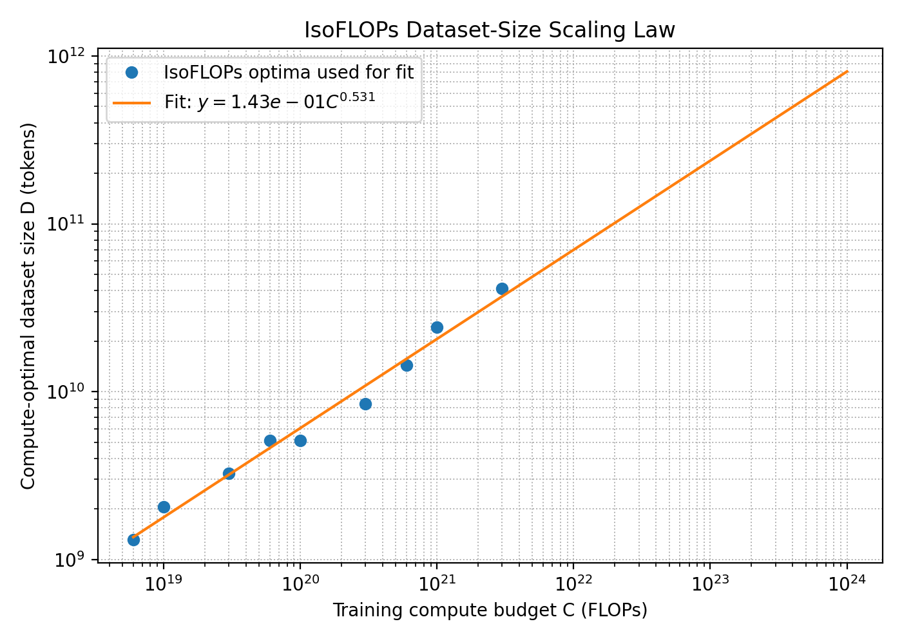
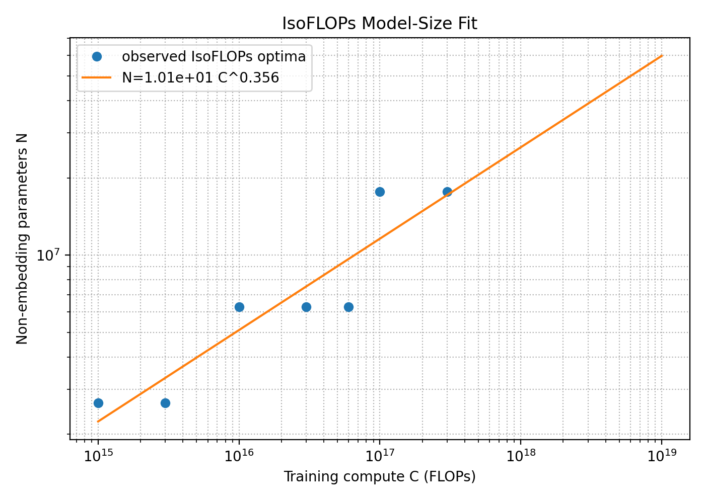
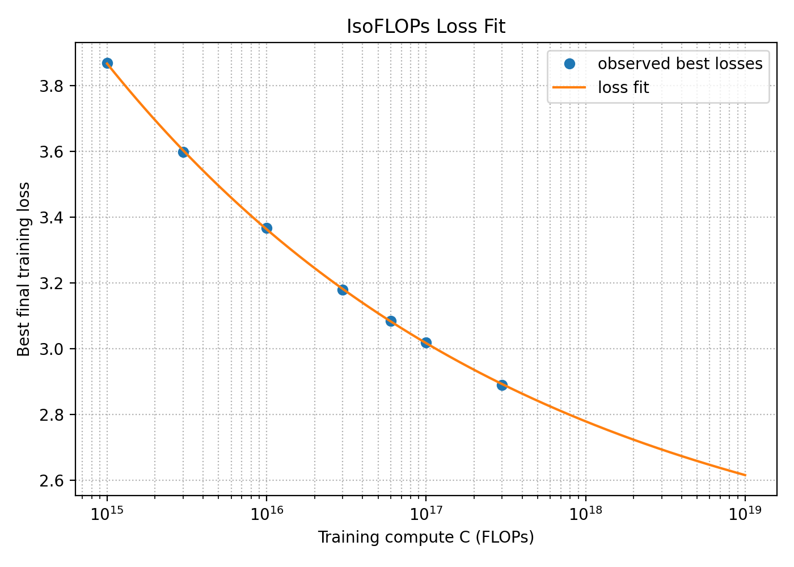

[TOC]

# 2 缩放定律回顾

### 2.1 从等FLOPs曲线得出的缩放定律

**问题：chinchilla_isoflops**



根据 IsoFLOPs scaling law 外推，`10^23` FLOPs 下的计算最优模型大小约为 `70B` 参数，`10^24` FLOPs 下约为 `206B` 参数。



根据 IsoFLOPs scaling law 外推，`10^23` FLOPs 下的计算最优数据集大小约为 `238B` tokens，`10^24` FLOPs 下约为 `809B` tokens。

# 3 构建缩放定律

**问题：scaling_laws**

**说明：官方 API 与自学版处理**

这道题官方要求使用 Stanford Training API 查询训练结果。API 背后的训练运行使用 §3.2 中描述的 Transformer，包括 absolute position embeddings、LayerNorm、GELU FFN、dropout、untied embeddings、AdamW、cosine learning-rate schedule 和 SlimPajama 数据集。

但是官方 API 需要课程注册过的 SSH public key 和 Stanford 网络/VPN。由于我不是 Stanford 学生，无法访问官方 API，所以这里完成的是一个公开课自学版实验：使用本地 synthetic training API 来复现实验设计、预算控制、IsoFLOPs 曲线构造、scaling law 拟合和外推流程。

需要注意的是，这个本地版本没有真实训练 §3.2 中的 Transformer，也不代表官方隐藏 API 的真实训练结果。它只是用于自学 scaling laws 方法论的 surrogate。

**本地 synthetic training API**

本地 API 仍然使用作业建议的非 embedding 参数量估计：

```text
N ≈ 12 * n_layer * d_model^2
```

给定训练计算预算 `C` 后，训练 token 数估计为：

```text
D = C / (6N)
```

synthetic final loss 使用一个 Chinchilla 风格的可解释形式：

```text
L(N, D) = E + A / N^alpha + B / D^beta + hyperparameter_penalty
```

其中 `hyperparameter_penalty` 让 loss 对 `learning_rate`、`batch_size` 和 head dimension 有轻微依赖。这样可以模拟“模型太小”和“数据太少”之间的权衡，同时保留超参数选择对 loss 的影响。

对应实现文件：

- `assignment3-scaling/cs336_scaling/local_api.py`
- `assignment3-scaling/scripts/run_local_scaling_study.py`
- `assignment3-scaling/scripts/fit_scaling_laws.py`

**实验预算设计**

作业要求 scaling-law 实验预算不超过：

```text
2e18 FLOPs
```

本地自学版实验共查询 `75` 个配置，总预算为：

```text
1.983e18 FLOPs
```

预算分配如下：

| 阶段 | 配置数 | 预算 |
| --- | ---: | ---: |
| `pilot_hparams` | `40` | `4.0e16` FLOPs |
| `stage1_isoflops` | `23` | `3.03e17` FLOPs |
| `stage2_high_compute` | `12` | `1.64e18` FLOPs |
| 合计 | `75` | `1.983e18` FLOPs |

设计思路是先用低 FLOPs 的 `pilot_hparams` 探索 `batch_size ∈ {128, 256}` 和若干 learning rate，再用 `stage1_isoflops` 扫描不同计算预算下的模型大小，最后用较高 FLOPs 的 `stage2_high_compute` 补充外推所需的高计算预算点。

**IsoFLOPs 最优点**

每个计算预算下选择 loss 最低的配置作为 `N_opt(C)`：

| `C` | `N_opt` | loss | layers | `d_model` | heads | batch | lr |
| ---: | ---: | ---: | ---: | ---: | ---: | ---: | ---: |
| `1e15` | `2.65M` | `3.868251` | `6` | `192` | `3` | `128` | `6e-4` |
| `3e15` | `2.65M` | `3.596996` | `6` | `192` | `3` | `128` | `6e-4` |
| `1e16` | `6.29M` | `3.366188` | `8` | `256` | `4` | `128` | `6e-4` |
| `3e16` | `6.29M` | `3.178757` | `8` | `256` | `4` | `128` | `6e-4` |
| `6e16` | `6.29M` | `3.084462` | `8` | `256` | `4` | `128` | `6e-4` |
| `1e17` | `17.69M` | `3.018695` | `10` | `384` | `6` | `128` | `6e-4` |
| `3e17` | `17.69M` | `2.890006` | `10` | `384` | `6` | `128` | `6e-4` |

**拟合结果**

模型大小 scaling law 为：

```text
N_opt(C) = 10.107419 * C^0.356427
```



loss scaling law 为：

```text
L_opt(C) = 2.256312 + 447.893350 * C^-0.162956
```



**对 `1e19` FLOPs 的预测**

连续 scaling law 外推得到：

```text
N_opt(1e19) ≈ 59.81M non-embedding parameters
predicted loss ≈ 2.615236
```

在 API 允许的离散超参数空间中，选择最接近该参数量的模型配置：

| 超参数 | 推荐值 |
| --- | ---: |
| `num_layers` | `22` |
| `d_model` | `476` |
| `num_heads` | `7` |
| estimated non-embedding params | `59.82M` |
| `batch_size` | `128` |
| `learning_rate` | `6e-4` |

一句话总结：

> 在本地 synthetic training API 上，我使用 `1.983e18` FLOPs 的实验预算构造 IsoFLOPs 曲线并拟合 scaling law，外推得到 `1e19` FLOPs 下的计算最优模型大小约为 `59.8M` non-embedding parameters，预测训练 loss 约为 `2.615`；对应推荐配置为 `22` layers、`d_model=476`、`7` heads、`batch_size=128`、`learning_rate=6e-4`。

**复现命令**

```bash
cd /mdata/wjx/CS336/assignment3-scaling
/mdata/wjx/miniconda3/bin/conda run -n coding python scripts/chinchilla_isoflops.py
/mdata/wjx/miniconda3/bin/conda run -n coding python scripts/run_local_scaling_study.py
/mdata/wjx/miniconda3/bin/conda run -n coding python scripts/fit_scaling_laws.py \
  --runs results/scaling_laws/local_runs.json \
  --output-dir results/scaling_laws/local_fit \
  --target-compute 1e19
```
